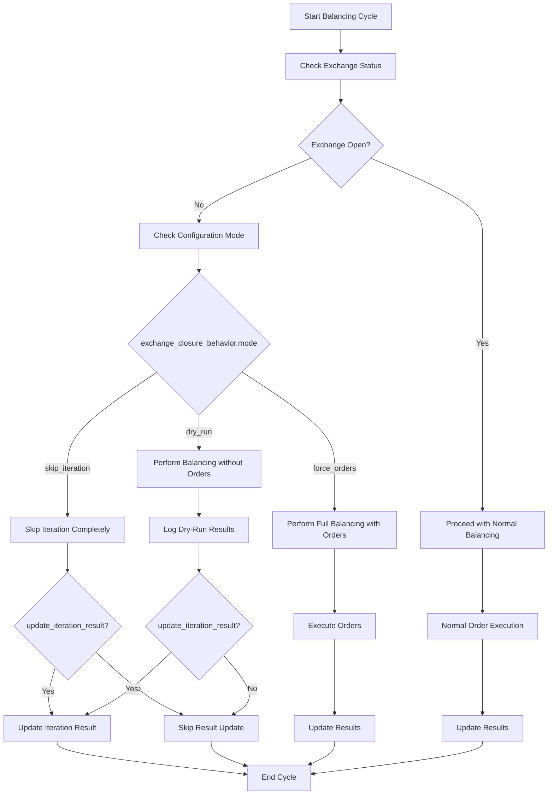

# Exchange Balancing Configuration Design

## Overview

This design addresses the requirement to make exchange closure behavior configurable in the Tinkoff Invest ETF balancer bot. Currently, the bot skips the entire balancing iteration when the exchange is closed, but users need three different behavior options:

1. **Skip iteration completely** (current behavior)
2. **Perform balancing and attempt to place orders** (try to place orders despite exchange closure)
3. **Perform balancing without placing orders** (dry-run mode during closure)

The solution involves extending the account configuration schema and modifying the core balancing logic to support these configurable behaviors.

## Architecture

### Configuration Schema Extension

The `AccountConfig` interface will be extended with a new `exchange_closure_behavior` configuration object:

```typescript
interface ExchangeClosureBehavior {
  mode: 'skip_iteration' | 'force_orders' | 'dry_run';
  update_iteration_result: boolean;
}

interface AccountConfig {
  // ... existing properties
  exchange_closure_behavior: ExchangeClosureBehavior;
}
```

### Core Components Modification

#### Configuration Loading
- **Component**: `src/configLoader.ts`
- **Modification**: Add validation for the new `exchange_closure_behavior` field
- **Default Values**: Provide backward compatibility with current behavior

#### Provider Logic
- **Component**: `src/provider/index.ts`
- **Modification**: Modify `getPositionsCycle()` function to handle different closure behaviors
- **Key Changes**: Replace simple exchange closure check with configurable behavior logic

#### Iteration Result Updates
- **Component**: Result logging and metrics collection
- **Modification**: Ensure iteration results are updated based on configuration

### Behavior Flow Diagram



### Data Models & Configuration

#### Type Definitions

```typescript
type ExchangeClosureMode = 'skip_iteration' | 'force_orders' | 'dry_run';

interface ExchangeClosureBehavior {
  /**
   * Behavior when exchange is closed:
   * - skip_iteration: Skip balancing completely (current behavior)
   * - force_orders: Perform balancing and attempt to place orders
   * - dry_run: Perform balancing calculations without placing orders
   */
  mode: ExchangeClosureMode;
  
  /**
   * Whether to update iteration results when exchange is closed
   * Affects logging and metrics collection
   */
  update_iteration_result: boolean;
}
```

#### Configuration Example

```json
{
  "accounts": [
    {
      "id": "account_1",
      "name": "Основной брокерский счет",
      "t_invest_token": "${T_INVEST_TOKEN_1}",
      "account_id": "BROKER",
      "desired_wallet": { ... },
      "desired_mode": "manual",
      "balance_interval": 3600000,
      "sleep_between_orders": 3000,
      "exchange_closure_behavior": {
        "mode": "dry_run",
        "update_iteration_result": true
      },
      "margin_trading": { ... }
    }
  ]
}
```

### Implementation Strategy

#### Phase 1: Configuration Schema
1. **Extend Type Definitions**
   - Add `ExchangeClosureBehavior` interface to `src/types.d.ts`
   - Update `AccountConfig` interface

2. **Update Configuration Loading**
   - Modify `src/configLoader.ts` to include new field validation
   - Set default values for backward compatibility
   - Add configuration validation logic

#### Phase 2: Core Logic Modification
1. **Provider Enhancement**
   - Modify `getPositionsCycle()` in `src/provider/index.ts`
   - Replace simple exchange closure skip with configurable behavior
   - Implement different handling paths for each mode

2. **Balancing Logic**
   - Ensure balancer can run in "calculation-only" mode for dry-run
   - Add logging for dry-run operations
   - Maintain order generation logic for force_orders mode

#### Phase 3: Result Management
1. **Iteration Result Updates**
   - Implement configurable result updates based on `update_iteration_result` flag
   - Ensure metrics and logging respect configuration
   - Maintain backward compatibility for result tracking

### Configuration Validation

#### Schema Validation Rules

| Field | Type | Required | Default | Validation |
|-------|------|----------|---------|------------|
| `mode` | `ExchangeClosureMode` | Yes | `skip_iteration` | Must be one of enum values |
| `update_iteration_result` | `boolean` | No | `false` | Boolean validation |

#### Error Handling
- **Invalid Mode**: Throw configuration error with valid options
- **Missing Configuration**: Use default values (current behavior)
- **Type Mismatches**: Provide clear validation messages

### Testing Strategy

#### Unit Tests
1. **Configuration Loading Tests**
   - Test default value assignment
   - Test validation of different mode values
   - Test backward compatibility

2. **Provider Logic Tests**
   - Test each exchange closure mode behavior
   - Test result update logic
   - Test integration with existing balancing flow

3. **Integration Tests**
   - Test complete balancing cycle with each mode
   - Test error scenarios
   - Test configuration migration

#### Test Scenarios

| Scenario | Exchange Status | Mode | Expected Behavior |
|----------|----------------|------|-------------------|
| Normal Operation | Open | Any | Standard balancing |
| Legacy Config | Closed | `skip_iteration` | Skip iteration (current) |
| Force Orders | Closed | `force_orders` | Attempt order placement |
| Dry Run | Closed | `dry_run` | Calculate without orders |
| Result Updates | Closed | Any + `update_iteration_result: true` | Update iteration results |

### Migration & Backward Compatibility

#### Default Behavior
- **Missing Configuration**: Default to `skip_iteration` mode with `update_iteration_result: false`
- **Partial Configuration**: Fill missing fields with defaults
- **Existing Installations**: No breaking changes, maintain current behavior

#### Configuration Migration
- **Automatic**: Apply defaults for missing fields during config loading
- **Documentation**: Update CONFIG.example.json with new options
- **Validation**: Warn users about deprecated or missing configurations

### Performance Considerations

#### Runtime Impact
- **Minimal Overhead**: Configuration check happens once per cycle
- **Memory Usage**: Negligible increase for configuration storage
- **API Calls**: No additional API calls for configuration

#### Optimization Strategies
- **Caching**: Cache configuration per account to avoid repeated parsing
- **Early Exit**: Optimize for most common scenario (exchange open)
- **Lazy Evaluation**: Only perform closure checks when needed

### Error Handling & Edge Cases

#### Error Scenarios
1. **Invalid Configuration Values**
   - Action: Throw validation error with correction guidance
   - Fallback: Use default safe configuration

2. **Exchange Status Check Failure**
   - Action: Log warning and continue with configured behavior
   - Fallback: Treat as exchange closed for safety

3. **Order Placement Failure in Force Mode**
   - Action: Log errors but continue iteration
   - Behavior: Respect normal error handling patterns

#### Edge Cases
1. **Exchange Reopens During Iteration**
   - Behavior: Complete current iteration with initial status determination
   - Rationale: Avoid mid-cycle behavior changes

2. **Multiple Account Configurations**
   - Behavior: Each account uses its own closure behavior independently
   - Isolation: No cross-account behavior interference

### Monitoring & Observability

#### Logging Enhancements
- **Mode Indication**: Log which closure behavior mode is active
- **Decision Points**: Log exchange status and resulting action
- **Dry-Run Results**: Special logging for calculation-only iterations

#### Metrics Collection
- **Behavior Tracking**: Track which modes are used in practice
- **Success Rates**: Monitor order success in force_orders mode
- **Performance Impact**: Track any latency changes

### Future Extensions

#### Potential Enhancements
1. **Time-Based Behaviors**: Different behaviors based on time of day
2. **Exchange-Specific Rules**: Different behaviors for different exchanges
3. **Dynamic Mode Switching**: Allow runtime mode changes
4. **Advanced Dry-Run**: More detailed dry-run simulation and reporting

#### API Extensions
- **Configuration API**: Allow runtime configuration updates
- **Status API**: Expose current exchange status and behavior mode
- **Metrics API**: Expose behavior-specific metrics and statistics