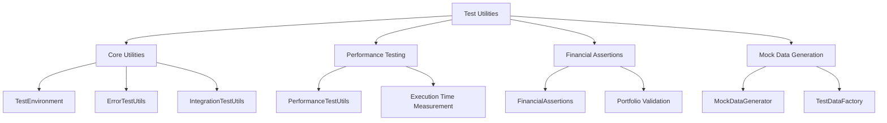

# Test Coverage Improvement Design

## Overview

This design document outlines comprehensive strategies to improve test coverage for files with currently low coverage percentages. The focus is on implementing unit tests, integration tests, and edge case coverage for critical components.

## Current Coverage Analysis

### Files with Low Coverage
1. **src/__tests__/test-utils/index.ts** (31.71% coverage)
2. **src/balancer/desiredBuilder.ts** (63.64% coverage) 
3. **src/balancer/index.ts** (12.50% coverage)
4. **src/configLoader.ts** (66.67% coverage)
5. **src/test-setup.ts** (22.22% coverage)
6. **src/tools/configManager.ts** (0.00% coverage)
7. **src/tools/etfCap.ts** (73.33% coverage)
8. **src/tools/pollEtfMetrics.ts** (12.50% coverage)

## Test Architecture Enhancement

### Test Utilities Enhancement



### Coverage Improvement Strategy

#### 1. Test Utilities (test-utils/index.ts) Enhancement

**Target Areas:**
- Untested utility methods (lines 52-60, 72-84, 91-97)
- Performance testing utilities (lines 274-294, 306-310)
- Mock data generators (lines 424-446, 458-478)
- Error testing utilities (lines 498-500, 504-510)

**New Test Cases:**
- TestEnvironment setup/teardown functionality
- PerformanceTestUtils with various execution scenarios
- MockDataGenerator edge cases and random data validation
- ErrorTestUtils retry logic and error matching
- TestScenarioBuilder complex scenario construction

#### 2. Balancer Core Module (balancer/index.ts)

**Target Areas:**
- Margin position identification logic (lines 47-73)
- Margin strategy application (lines 80-115)
- Portfolio balancing calculations (lines 158-179, 184-188)
- Order generation and execution paths (lines 192-505)

**Test Scenarios:**
- Margin trading enabled/disabled scenarios
- Portfolio rebalancing with various allocation strategies
- Error handling for invalid configurations
- Edge cases for extreme portfolio imbalances

#### 3. Desired Wallet Builder (balancer/desiredBuilder.ts)

**Target Areas:**
- Mode validation logic (lines 30-121)
- Metric data gathering (lines 167-168, 172-182)
- Market cap calculation fallbacks (lines 186-196, 206, 209)
- AUM calculation methods (lines 211-214, 217-218)
- Decorrelation algorithm (lines 246-260, 263-267)

**Test Coverage:**
- All allocation modes (manual, marketcap, aum, marketcap_aum, decorrelation)
- Data validation for each mode
- Fallback mechanisms for missing data
- Error scenarios and recovery

#### 4. Configuration Management (configLoader.ts)

**Target Areas:**
- Configuration validation methods (lines 86-92)
- Account token resolution (lines 96-123)
- Exchange closure behavior validation (lines 128-142)

**Test Cases:**
- Invalid configuration handling
- Environment variable resolution
- Token format validation
- Exchange closure mode validation

#### 5. Tools Module Testing

**configManager.ts (0% coverage):**
- CLI command parsing and execution
- Account information display
- Configuration validation
- Environment setup utilities

**etfCap.ts (73.33% coverage):**
- Market cap calculation methods
- ETF data fetching and caching
- Error handling for API failures
- Data normalization and validation

**pollEtfMetrics.ts (12.50% coverage):**
- Metrics polling functionality
- Data persistence and retrieval
- API integration error handling
- Retry mechanisms and timeouts

## Test Implementation Plan

### Phase 1: Core Utilities Testing

#### Test Environment Enhancement
```typescript
// Enhanced test environment setup
describe('TestEnvironment', () => {
  it('should setup and teardown test environment correctly')
  it('should handle mock reset and environment variables')
  it('should maintain isolated test state')
  it('should handle Date.now mocking consistently')
})
```

#### Performance Testing Framework
```typescript
// Performance measurement testing
describe('PerformanceTestUtils', () => {
  it('should measure execution time accurately')
  it('should enforce time limits for operations')
  it('should calculate performance statistics')
  it('should handle async operations correctly')
})
```

#### Financial Assertions Framework
```typescript
// Financial data validation testing  
describe('FinancialAssertions', () => {
  it('should validate portfolio balance within tolerance')
  it('should compare TinkoffNumber values correctly')
  it('should validate margin position requirements')
  it('should check wallet normalization')
})
```

### Phase 2: Balancer Module Testing

#### Margin Trading Logic
```typescript
// Comprehensive margin trading tests
describe('Margin Trading', () => {
  it('should identify margin positions correctly')
  it('should apply margin strategies appropriately')
  it('should handle margin disabled scenarios')
  it('should calculate optimal position sizes')
  it('should validate margin limits and constraints')
})
```

#### Portfolio Balancing Core
```typescript
// Portfolio balancing comprehensive tests
describe('Portfolio Balancing', () => {
  it('should balance portfolios with various strategies')
  it('should handle extreme imbalances gracefully')
  it('should generate correct orders for rebalancing')
  it('should respect dry-run mode constraints')
  it('should calculate enhanced results accurately')
})
```

### Phase 3: Configuration and Tools Testing

#### Configuration Management
```typescript
// Configuration loading and validation
describe('ConfigLoader', () => {
  it('should load and validate configurations')
  it('should resolve environment variables correctly')
  it('should handle invalid configurations gracefully')
  it('should support backward compatibility')
})
```

#### CLI Tools Testing
```typescript
// Command-line tools testing
describe('ConfigManager CLI', () => {
  it('should display account information correctly')
  it('should validate configuration files')
  it('should handle environment variable setup')
  it('should manage token configurations')
})
```

### Phase 4: Integration Testing Enhancement

#### End-to-End Workflow Testing
```typescript
// Complete workflow integration tests
describe('Integration Tests', () => {
  it('should execute complete rebalancing workflow')
  it('should handle API failures gracefully')
  it('should maintain data consistency across operations')
  it('should support multiple account configurations')
})
```

## Test Data Management

### Fixture Enhancement
- Extended market data scenarios
- Complex portfolio configurations
- Edge case account setups
- Invalid configuration examples

### Mock Strategy Improvement
- Comprehensive API response mocking
- Error scenario simulation
- Network failure handling
- Rate limiting simulation

## Coverage Metrics and Goals

### Target Coverage Levels
- **Unit Tests:** 90%+ line coverage
- **Integration Tests:** 80%+ feature coverage
- **Error Handling:** 95%+ error path coverage
- **Edge Cases:** 85%+ boundary condition coverage

### Measurement Strategy
- Line coverage tracking
- Branch coverage analysis
- Function coverage validation
- Condition coverage assessment

## Performance Testing Integration

### Benchmarking Framework
- Execution time measurement
- Memory usage tracking
- API response time monitoring
- Throughput analysis

### Performance Test Cases
- Large portfolio processing
- Multiple account handling
- Concurrent operation testing
- Resource usage validation

## Error Handling and Edge Cases

### Error Scenario Coverage
- Network connectivity issues
- Invalid API responses
- Configuration file corruption
- Environment variable missing
- Rate limit exceeded
- Authentication failures

### Edge Case Testing
- Empty portfolios
- Single asset portfolios
- Extreme allocation percentages
- Zero-value positions
- Market closure scenarios
- Margin call situations

## Quality Assurance

### Test Quality Metrics
- Test maintainability score
- Test execution speed
- Test reliability metrics
- Code coverage trends

### Continuous Improvement
- Regular coverage review
- Test performance monitoring
- False positive identification
- Test case effectiveness analysis

## Implementation Timeline

### Week 1: Foundation
- Test utilities enhancement
- Core testing framework setup
- Mock strategy implementation

### Week 2: Core Modules
- Balancer module comprehensive testing
- Configuration management testing
- Error handling implementation

### Week 3: Tools and Integration
- CLI tools testing
- Integration test enhancement
- Performance testing framework

### Week 4: Quality Assurance
- Coverage validation
- Performance optimization
- Documentation updates
- Final validation testing1. **src/__tests__/test-utils/index.ts** (31.71% coverage)
2. **src/balancer/desiredBuilder.ts** (63.64% coverage) 
3. **src/balancer/index.ts** (12.50% coverage)
4. **src/configLoader.ts** (66.67% coverage)
5. **src/test-setup.ts** (22.22% coverage)
6. **src/tools/configManager.ts** (0.00% coverage)
7. **src/tools/etfCap.ts** (73.33% coverage)
8. **src/tools/pollEtfMetrics.ts** (12.50% coverage)

## Test Architecture Enhancement

### Test Utilities Enhancement


### Coverage Improvement Strategy

#### 1. Test Utilities (test-utils/index.ts) Enhancement

**Target Areas:**
- Untested utility methods (lines 52-60, 72-84, 91-97)
- Performance testing utilities (lines 274-294, 306-310)
- Mock data generators (lines 424-446, 458-478)
- Error testing utilities (lines 498-500, 504-510)

**New Test Cases:**
- TestEnvironment setup/teardown functionality
- PerformanceTestUtils with various execution scenarios
- MockDataGenerator edge cases and random data validation
- ErrorTestUtils retry logic and error matching
- TestScenarioBuilder complex scenario construction

#### 2. Balancer Core Module (balancer/index.ts)

**Target Areas:**
- Margin position identification logic (lines 47-73)
- Margin strategy application (lines 80-115)
- Portfolio balancing calculations (lines 158-179, 184-188)
- Order generation and execution paths (lines 192-505)

**Test Scenarios:**
- Margin trading enabled/disabled scenarios
- Portfolio rebalancing with various allocation strategies
- Error handling for invalid configurations
- Edge cases for extreme portfolio imbalances

#### 3. Desired Wallet Builder (balancer/desiredBuilder.ts)

**Target Areas:**
- Mode validation logic (lines 30-121)
- Metric data gathering (lines 167-168, 172-182)
- Market cap calculation fallbacks (lines 186-196, 206, 209)
- AUM calculation methods (lines 211-214, 217-218)
- Decorrelation algorithm (lines 246-260, 263-267)

**Test Coverage:**
- All allocation modes (manual, marketcap, aum, marketcap_aum, decorrelation)
- Data validation for each mode
- Fallback mechanisms for missing data
- Error scenarios and recovery

#### 4. Configuration Management (configLoader.ts)

**Target Areas:**
- Configuration validation methods (lines 86-92)
- Account token resolution (lines 96-123)
- Exchange closure behavior validation (lines 128-142)

**Test Cases:**
- Invalid configuration handling
- Environment variable resolution
- Token format validation
- Exchange closure mode validation

#### 5. Tools Module Testing

**configManager.ts (0% coverage):**
- CLI command parsing and execution
- Account information display
- Configuration validation
- Environment setup utilities

**etfCap.ts (73.33% coverage):**
- Market cap calculation methods
- ETF data fetching and caching
- Error handling for API failures
- Data normalization and validation

**pollEtfMetrics.ts (12.50% coverage):**
- Metrics polling functionality
- Data persistence and retrieval
- API integration error handling
- Retry mechanisms and timeouts

## Test Implementation Plan

### Phase 1: Core Utilities Testing

#### Test Environment Enhancement
```typescript
// Enhanced test environment setup
describe('TestEnvironment', () => {
  it('should setup and teardown test environment correctly')
  it('should handle mock reset and environment variables')
  it('should maintain isolated test state')
  it('should handle Date.now mocking consistently')
})
```

#### Performance Testing Framework
```typescript
// Performance measurement testing
describe('PerformanceTestUtils', () => {
  it('should measure execution time accurately')
  it('should enforce time limits for operations')
  it('should calculate performance statistics')
  it('should handle async operations correctly')
})
```

#### Financial Assertions Framework
```typescript
// Financial data validation testing  
describe('FinancialAssertions', () => {
  it('should validate portfolio balance within tolerance')
  it('should compare TinkoffNumber values correctly')
  it('should validate margin position requirements')
  it('should check wallet normalization')
})
```

### Phase 2: Balancer Module Testing

#### Margin Trading Logic
```typescript
// Comprehensive margin trading tests
describe('Margin Trading', () => {
  it('should identify margin positions correctly')
  it('should apply margin strategies appropriately')
  it('should handle margin disabled scenarios')
  it('should calculate optimal position sizes')
  it('should validate margin limits and constraints')
})
```

#### Portfolio Balancing Core
```typescript
// Portfolio balancing comprehensive tests
describe('Portfolio Balancing', () => {
  it('should balance portfolios with various strategies')
  it('should handle extreme imbalances gracefully')
  it('should generate correct orders for rebalancing')
  it('should respect dry-run mode constraints')
  it('should calculate enhanced results accurately')
})
```

### Phase 3: Configuration and Tools Testing

#### Configuration Management
```typescript
// Configuration loading and validation
describe('ConfigLoader', () => {
  it('should load and validate configurations')
  it('should resolve environment variables correctly')
  it('should handle invalid configurations gracefully')
  it('should support backward compatibility')
})
```

#### CLI Tools Testing
```typescript
// Command-line tools testing
describe('ConfigManager CLI', () => {
  it('should display account information correctly')
  it('should validate configuration files')
  it('should handle environment variable setup')
  it('should manage token configurations')
})
```

### Phase 4: Integration Testing Enhancement

#### End-to-End Workflow Testing
```typescript
// Complete workflow integration tests
describe('Integration Tests', () => {
  it('should execute complete rebalancing workflow')
  it('should handle API failures gracefully')
  it('should maintain data consistency across operations')
  it('should support multiple account configurations')
})
```

## Test Data Management

### Fixture Enhancement
- Extended market data scenarios
- Complex portfolio configurations
- Edge case account setups
- Invalid configuration examples

### Mock Strategy Improvement
- Comprehensive API response mocking
- Error scenario simulation
- Network failure handling
- Rate limiting simulation

## Coverage Metrics and Goals

### Target Coverage Levels
- **Unit Tests:** 90%+ line coverage
- **Integration Tests:** 80%+ feature coverage
- **Error Handling:** 95%+ error path coverage
- **Edge Cases:** 85%+ boundary condition coverage

### Measurement Strategy
- Line coverage tracking
- Branch coverage analysis
- Function coverage validation
- Condition coverage assessment

## Performance Testing Integration

### Benchmarking Framework
- Execution time measurement
- Memory usage tracking
- API response time monitoring
- Throughput analysis

### Performance Test Cases
- Large portfolio processing
- Multiple account handling
- Concurrent operation testing
- Resource usage validation

## Error Handling and Edge Cases

### Error Scenario Coverage
- Network connectivity issues
- Invalid API responses
- Configuration file corruption
- Environment variable missing
- Rate limit exceeded
- Authentication failures

### Edge Case Testing
- Empty portfolios
- Single asset portfolios
- Extreme allocation percentages
- Zero-value positions
- Market closure scenarios
- Margin call situations

## Quality Assurance

### Test Quality Metrics
- Test maintainability score
- Test execution speed
- Test reliability metrics
- Code coverage trends

### Continuous Improvement
- Regular coverage review
- Test performance monitoring
- False positive identification
- Test case effectiveness analysis

## Implementation Timeline

### Week 1: Foundation
- Test utilities enhancement
- Core testing framework setup
- Mock strategy implementation

### Week 2: Core Modules
- Balancer module comprehensive testing
- Configuration management testing
- Error handling implementation

### Week 3: Tools and Integration
- CLI tools testing
- Integration test enhancement
- Performance testing framework

### Week 4: Quality Assurance
- Coverage validation
- Performance optimization
- Documentation updates
- Final validation testing


