# Portfolio Balancing Debugger

## Overview

This document analyzes the portfolio balancing issue where the bot incorrectly distributes assets across only 3 ETFs (TMOS: 34.57%, TRUR: 32.96%, TGLD: 32.47%) instead of the configured 12 ETFs with equal 8.33% allocation each.

## Problem Analysis

### Expected vs Actual Behavior

**Expected Configuration:**
- 12 ETFs with equal allocation: 8.33% each
- Total: 100% distributed across all ETFs

**Actual Balancing Result:**
- Only 3 ETFs have positions: TMOS (34.57%), TRUR (32.96%), TGLD (32.47%)  
- 9 ETFs with 0% allocation: TMON, TPAY, TOFZ, TDIV, TLCB, TRND, TBRU, TITR
- Mode used: manual (should use static allocation)

### Root Cause Hypothesis

The issue likely stems from **current portfolio state filtering** rather than configuration processing. The balancer only operates on instruments that exist in the current portfolio (`coreWallet`), missing ETFs that have zero holdings.

## Technical Architecture Analysis

### Configuration Processing Flow

```mermaid
flowchart TD
    A[CONFIG.json] --> B[configLoader.loadConfig()]
    B --> C[Account Configuration]
    C --> D[desired_wallet: 12 ETFs @ 8.33%]
    D --> E[buildDesiredWalletByMode('manual')]
    E --> F[Returns wallet unchanged in manual mode]
    F --> G[balancer() function]
```

### Current Portfolio Fetching Flow

```mermaid
flowchart TD
    A[Tinkoff API] --> B[operations.getPortfolio()]
    B --> C[portfolioPositions]
    C --> D{Filter positions}
    D --> E[Only positions with amount > 0]
    E --> F[coreWallet array]
    F --> G[Missing ETFs not added to wallet]
```

### Balancer Processing Logic


## Identified Issues

### Issue 1: Instrument Discovery Failure

**Problem:** ETFs not in current portfolio may not be found in the `INSTRUMENTS` global variable.

**Code Location:** `src/balancer/index.ts:245-286`

```typescript
const findedInstumentByTicker = _.find((global as any).INSTRUMENTS, 
  (i: any) => tickersEqual(i.ticker, desiredTicker));

if (!findedInstumentByTicker || !figi || !lotSize) {
  debug(`Instrument for ticker ${desiredTicker} not found in INSTRUMENTS. Skipping addition.`);
  continue; // ← This skips the ETF entirely
}
```

### Issue 2: Instruments List Population

**Problem:** `(global as any).INSTRUMENTS` may not contain all required ETFs.

**Code Location:** `src/provider/index.ts` in `getInstruments()` function

The instruments list needs to include all ETFs specified in desired_wallet.

### Issue 3: Price Fetching Failures

**Problem:** If `getLastPrice()` fails for an ETF, it gets skipped.

**Code Location:** `src/balancer/index.ts:261-265`

```typescript
const lastPrice = await getLastPrice(figi);
if (!lastPrice) {
  debug(`Could not get lastPrice for ${desiredTicker}/${figi}. Skipping addition.`);
  continue; // ← Another skip condition
}
```

## Diagnostic Strategy

### Debug Logging Analysis

Enable debug logging to trace the issue:

```bash
DEBUG=bot* bun run dev
```

**Key Debug Points:**
1. `desiredWallet` content after `buildDesiredWalletByMode()`
2. `INSTRUMENTS` global variable contents
3. Position creation attempts for missing ETFs
4. Price fetching results for each ticker

### Configuration Validation

```typescript
// Expected desired_wallet structure
{
  "TRAY": 8.33,
  "TGLD": 8.33, 
  "TRUR": 8.33,
  "TRND": 8.33,
  "TBRU": 8.33,
  "TDIV": 8.33,
  "TITR": 8.33,
  "TLCB": 8.33,
  "TMON": 8.33,
  "TMOS": 8.33,
  "TOFZ": 8.33,
  "TPAY": 8.33
}
```

### Current Portfolio State Analysis

Check if missing ETFs exist in current portfolio:
- If ETFs have zero holdings, they won't appear in `portfolioPositions`
- The balancer should create new positions for missing ETFs
- Verify which step is failing the position creation

## Data Flow Debugging

### Step 1: Configuration Loading

```mermaid
sequenceDiagram
    participant Config as CONFIG.json
    participant Loader as configLoader
    participant Account as AccountConfig
    
    Config->>Loader: Read desired_wallet
    Loader->>Account: Validate 12 ETFs @ 8.33%
    Account-->>Loader: ✅ Valid configuration
```


### Step 2: Portfolio Fetching


### Step 3: Balancer Execution


## Testing Approach

### Test Case 1: Instrument Discovery
Verify all 12 ETFs exist in `INSTRUMENTS`:

```typescript
const missingETFs = [];
const configuredETFs = Object.keys(desired_wallet);

for (const ticker of configuredETFs) {
  const instrument = _.find(INSTRUMENTS, i => tickersEqual(i.ticker, ticker));
  if (!instrument) {
    missingETFs.push(ticker);
  }
}

console.log('Missing instruments:', missingETFs);
```

### Test Case 2: Price Fetching
Test price fetching for all ETFs:

```typescript
for (const ticker of configuredETFs) {
  const instrument = _.find(INSTRUMENTS, i => tickersEqual(i.ticker, ticker));
  if (instrument) {
    const price = await getLastPrice(instrument.figi);
    console.log(`${ticker}: ${price ? 'SUCCESS' : 'FAILED'}`);
  }
}
```

### Test Case 3: Manual Balancer Test
Create minimal test with known working ETFs:

```typescript
const testWallet: Wallet = [
  // Add RUB position
  // Add current 3 ETF positions  
  // Ensure INSTRUMENTS contains all test tickers
];

const testDesired: DesiredWallet = {
  "TMOS": 25,
  "TRUR": 25, 
  "TGLD": 25,
  "TRAY": 25  // New ETF to test addition
};
```

## Recommended Fixes

### Fix 1: Enhance Instrument Loading
Ensure `getInstruments()` loads all required ETFs:

```typescript
// In provider/index.ts
export const ensureInstrumentsForTickers = async (tickers: string[]) => {
  const missing = tickers.filter(ticker => 
    !_.find(INSTRUMENTS, i => tickersEqual(i.ticker, ticker))
  );
  
  if (missing.length > 0) {
    console.log(`Loading missing instruments: ${missing.join(', ')}`);
    // Implement specific instrument loading logic
  }
};
```

### Fix 2: Improve Error Handling
Add better error handling for missing instruments:

```typescript
// In balancer/index.ts
if (!findedInstumentByTicker || !figi || !lotSize) {
  console.warn(`⚠️ Instrument ${desiredTicker} not found. Check ticker spelling or instrument availability.`);
  // Consider continuing with warning instead of skipping
  continue;
}
```

### Fix 3: Enhanced Debug Output
Add comprehensive logging for balancer decisions:

```typescript
console.log(`\n🔍 Processing ${Object.keys(desiredWallet).length} desired positions:`);
for (const [ticker, percent] of Object.entries(desiredWallet)) {
  const found = wallet.find(p => tickersEqual(p.base, ticker));
  console.log(`  ${ticker}: ${percent}% ${found ? '✅ In portfolio' : '❌ Missing - will attempt to add'}`);
}
```

## Implementation Priority

1. **High Priority**: Add debug logging to identify exact failure point
2. **High Priority**: Verify `INSTRUMENTS` contains all 12 ETFs  
3. **Medium Priority**: Improve error handling for missing instruments
4. **Medium Priority**: Add price fetching retry logic
5. **Low Priority**: Enhance user-facing error messages

## Expected Outcome

After implementing fixes, the balancer should:
- Successfully process all 12 ETFs from configuration
- Create new positions for ETFs not in current portfolio
- Distribute assets equally: 8.33% per ETF
- Show balanced allocation across all configured instruments