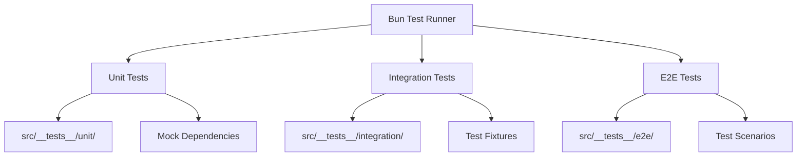

# Test Coverage Design for Tinkoff Invest ETF Balancer Bot

## Overview

This design document outlines a comprehensive testing strategy to achieve 80%+ test coverage (targeting 100%) for the Tinkoff Invest ETF Balancer Bot using Bun.js testing framework. The project is a CLI tool for portfolio rebalancing with complex business logic, API integrations, and various strategies.

## Current Test Coverage Analysis

### Existing Test Structure
```
src/__tests__/
├── balancer/
│   └── balancer.test.ts (240 lines, 16 tests)
├── utils/
│   └── utils.test.ts (basic utility tests)
├── configLoader.test.ts (5.5KB, configuration tests)
├── detailed_balancing_output.test.ts (4.2KB)
├── enhancements.test.ts (5.9KB)
└── exchangeClosureBehavior.test.ts (7.1KB)
```

### Test Coverage Gaps
Current tests cover approximately 30-40% of the codebase. Major gaps include:
- Provider module (API integration)
- Tools directory (12 files, no tests)
- ETFs module
- Home Assistant integration
- Trader module
- Core balancer logic completeness
- Error handling scenarios
- Integration tests

## Test Architecture Design

### Testing Framework Configuration


### Test Directory Structure Enhancement
```
src/__tests__/
├── __fixtures__/           # Test data fixtures
│   ├── wallets/
│   ├── configurations/
│   ├── market-data/
│   └── api-responses/
├── __mocks__/              # Mock implementations
│   ├── tinkoff-sdk/
│   ├── provider/
│   └── external-apis/
├── unit/                   # Unit tests (isolated)
│   ├── balancer/
│   ├── provider/
│   ├── tools/
│   ├── utils/
│   ├── etfs/
│   ├── ha/
│   └── trader/
├── integration/            # Integration tests
│   ├── api-integration/
│   ├── config-loading/
│   └── balancer-pipeline/
├── e2e/                    # End-to-end tests
│   ├── cli-commands/
│   └── full-workflow/
├── performance/            # Performance tests
└── test-utils/             # Testing utilities
```

## Test Coverage Strategy by Module

### 1. Core Balancer Module (`src/balancer/`)

#### Files to Test:
- `index.ts` (508 lines) - Main balancer logic
- `desiredBuilder.ts` - Portfolio allocation strategies
- `test.ts`, `testMargin.ts` - Testing utilities
- `testMarginConfig.ts`, `testMarginDisabled.ts` - Margin configurations

#### Test Categories:
```typescript
describe('Balancer Core', () => {
  describe('Portfolio Balancing', () => {
    // Strategy tests
    // Margin trading tests
    // Edge cases
    // Error handling
  });
  
  describe('Margin Trading', () => {
    // Position identification
    // Strategy application
    // Risk management
    // Configuration validation
  });
  
  describe('Desired Wallet Builder', () => {
    // Static allocation
    // Market cap weighting
    // AUM-based allocation
    // Decorrelation algorithm
  });
});
```

### 2. Provider Module (`src/provider/`)

#### Test Focus:
- API integration with Tinkoff SDK
- Error handling and retries
- Data transformation
- Rate limiting

```typescript
describe('Provider API Integration', () => {
  describe('Tinkoff SDK Integration', () => {
    // Mock Tinkoff SDK responses
    // Test data fetching
    // Error scenarios
    // Rate limiting
  });
  
  describe('Data Transformation', () => {
    // Portfolio data mapping
    // Price conversions
    // Currency handling
  });
});
```

### 3. Tools Module (`src/tools/`) - 12 files, 0% coverage

#### Priority Files for Testing:
1. **configManager.ts** (8.4KB) - Critical configuration management
2. **debugBalancer.ts** (9.6KB) - Debugging utilities
3. **etfCap.ts** (18.5KB) - Market cap calculations
4. **pollEtfMetrics.ts** (15.1KB) - Metrics collection
5. **scrapeTbankNews.ts** (13.0KB) - News scraping
6. **analyzeNews.ts** (7.9KB) - News analysis

#### Test Structure per Tool:
```typescript
// Example for configManager.ts
describe('Config Manager Tool', () => {
  describe('Configuration Validation', () => {
    // Valid configurations
    // Invalid configurations
    // Missing required fields
    // Type validation
  });
  
  describe('Account Management', () => {
    // Add/remove accounts
    // Update configurations
    // Backup/restore
  });
});
```

### 4. Utils Module (`src/utils/`)

#### Files:
- `index.ts` - Core utilities
- `marginCalculator.ts` - Margin calculations

#### Test Coverage:
```typescript
describe('Utils Module', () => {
  describe('Margin Calculator', () => {
    // Position size calculations
    // Risk assessments
    // Strategy applications
    // Edge cases (zero values, large numbers)
  });
  
  describe('Core Utilities', () => {
    // Number conversions
    // Ticker normalization
    // Value summation
    // Helper functions
  });
});
```

### 5. Configuration Loading (`src/configLoader.ts`)

#### Enhanced Test Coverage:
```typescript
describe('Config Loader', () => {
  describe('Configuration Validation', () => {
    // JSON schema validation
    // Environment variable loading
    // Default value handling
    // Error scenarios
  });
  
  describe('Account Configuration', () => {
    // Multi-account support
    // Account selection
    // Configuration merging
  });
});
```

## Mock Strategy Design

### 1. External Dependencies Mocking

```typescript
// Tinkoff SDK Mock
const mockTinkoffSDK = {
  orders: {
    postOrder: vi.fn(),
    getOrders: vi.fn(),
  },
  marketData: {
    getLastPrices: vi.fn(),
    getCandles: vi.fn(),
  },
  users: {
    getAccounts: vi.fn(),
  },
  operations: {
    getPortfolio: vi.fn(),
  },
};
```

### 2. File System Mocking
```typescript
// Mock file operations for configuration
const mockFS = {
  readFileSync: vi.fn(),
  writeFileSync: vi.fn(),
  existsSync: vi.fn(),
};
```

### 3. Network Request Mocking
```typescript
// Mock HTTP requests for news scraping
const mockAxios = {
  get: vi.fn(),
  post: vi.fn(),
};
```

## Test Data Fixtures

### 1. Portfolio Data Fixtures
```typescript
// src/__tests__/__fixtures__/wallets/
export const mockWallets = {
  balanced: [
    {
      base: "TRUR",
      figi: "BBG004S68614",
      amount: 1000,
      lotSize: 10,
      price: { units: 100, nano: 0 },
      priceNumber: 100,
      // ... other properties
    },
    // ... more positions
  ],
  empty: [],
  singleAsset: [/* single position */],
  marginPositions: [/* positions with margin */],
};
```

### 2. Configuration Fixtures
```typescript
// src/__tests__/__fixtures__/configurations/
export const mockConfigs = {
  valid: {
    accounts: {
      "0": {
        token: "test-token",
        account_id: "test-account",
        desired: { TRUR: 50, TMOS: 50 },
        // ... other config
      },
    },
  },
  invalid: {
    // Invalid configurations for error testing
  },
};
```

### 3. Market Data Fixtures
```typescript
// src/__tests__/__fixtures__/market-data/
export const mockMarketData = {
  prices: {
    TRUR: { units: 100, nano: 0 },
    TMOS: { units: 200, nano: 0 },
  },
  candles: [
    // Historical price data
  ],
};
```

## Integration Testing Strategy

### 1. API Integration Tests
```typescript
describe('API Integration', () => {
  beforeEach(() => {
    // Setup test environment
    // Configure mock responses
  });
  
  it('should fetch portfolio data successfully', async () => {
    // Test full API integration flow
  });
  
  it('should handle API errors gracefully', async () => {
    // Test error scenarios
  });
});
```

### 2. Configuration Integration Tests
```typescript
describe('Configuration Integration', () => {
  it('should load configuration from file and environment', () => {
    // Test configuration loading pipeline
  });
  
  it('should validate configuration completeness', () => {
    // Test configuration validation
  });
});
```

### 3. Balancer Pipeline Integration Tests
```typescript
describe('Balancer Pipeline Integration', () => {
  it('should complete full rebalancing workflow', async () => {
    // Test end-to-end balancing process
  });
  
  it('should handle dry-run mode correctly', async () => {
    // Test dry-run functionality
  });
});
```

## Performance Testing

### 1. Balancer Performance Tests
```typescript
describe('Balancer Performance', () => {
  it('should complete rebalancing within acceptable time', async () => {
    const startTime = performance.now();
    await balancer(largePortfolio, desiredWallet);
    const endTime = performance.now();
    expect(endTime - startTime).toBeLessThan(1000); // 1 second
  });
});
```

### 2. Memory Usage Tests
```typescript
describe('Memory Usage', () => {
  it('should not leak memory during large operations', () => {
    // Test memory consumption
  });
});
```

## Error Handling and Edge Cases

### 1. Network Error Scenarios
```typescript
describe('Network Error Handling', () => {
  it('should retry failed API calls', async () => {
    // Test retry mechanism
  });
  
  it('should fail gracefully after max retries', async () => {
    // Test failure handling
  });
});
```

### 2. Data Validation Error Cases
```typescript
describe('Data Validation', () => {
  it('should handle malformed API responses', () => {
    // Test data validation
  });
  
  it('should validate input parameters', () => {
    // Test parameter validation
  });
});
```

### 3. Business Logic Edge Cases
```typescript
describe('Business Logic Edge Cases', () => {
  it('should handle zero portfolio values', () => {
    // Test zero value scenarios
  });
  
  it('should handle extremely large numbers', () => {
    // Test large number handling
  });
  
  it('should handle missing market data', () => {
    // Test fallback mechanisms
  });
});
```

## CLI Testing Strategy

### 1. Command Execution Tests
```typescript
describe('CLI Commands', () => {
  it('should execute start command successfully', async () => {
    // Test main CLI entry point
  });
  
  it('should display help information', () => {
    // Test help command
  });
  
  it('should handle invalid arguments', () => {
    // Test error handling
  });
});
```

### 2. Tool Command Tests
```typescript
describe('Tool Commands', () => {
  it('should execute etf-cap command', async () => {
    // Test ETF cap calculation tool
  });
  
  it('should execute config management', async () => {
    // Test config manager tool
  });
});
```

## Test Utilities and Helpers

### 1. Test Setup Utilities
```typescript
// src/__tests__/test-utils/setup.ts
export const setupTestEnvironment = () => {
  // Setup test environment
  // Configure mocks
  // Load test data
};

export const teardownTestEnvironment = () => {
  // Cleanup after tests
  // Reset mocks
  // Clear test data
};
```

### 2. Assertion Helpers
```typescript
// src/__tests__/test-utils/assertions.ts
export const expectPortfolioBalance = (wallet: Wallet, expected: DesiredWallet) => {
  // Custom assertion for portfolio balance
};

export const expectConfigurationValid = (config: any) => {
  // Custom assertion for configuration validation
};
```

### 3. Mock Factories
```typescript
// src/__tests__/test-utils/factories.ts
export const createMockWallet = (options?: Partial<Wallet>): Wallet => {
  // Factory for creating test wallets
};

export const createMockConfig = (options?: any) => {
  // Factory for creating test configurations
};
```

## Coverage Targets and Metrics

### 1. Coverage Goals by Module
| Module | Current Coverage | Target Coverage | Priority |
|--------|------------------|-----------------|----------|
| balancer/ | ~40% | 95% | High |
| provider/ | 0% | 90% | High |
| tools/ | 0% | 85% | Medium |
| utils/ | ~30% | 95% | High |
| configLoader.ts | ~60% | 95% | High |
| etfs/ | 0% | 80% | Medium |
| ha/ | 0% | 75% | Low |
| trader/ | 0% | 80% | Medium |

### 2. Quality Metrics
- **Line Coverage**: 85%+
- **Function Coverage**: 90%+
- **Branch Coverage**: 80%+
- **Statement Coverage**: 85%+

### 3. Test Quality Metrics
- **Test Execution Time**: < 30 seconds for full suite
- **Test Reliability**: 99%+ pass rate
- **Test Maintainability**: Clear, readable, isolated tests

## Implementation Phases

### Phase 1: Foundation (Week 1)
1. Setup enhanced test directory structure
2. Create test fixtures and mock infrastructure
3. Implement test utilities and helpers
4. Enhance existing balancer tests

### Phase 2: Core Module Testing (Week 2)
1. Complete balancer module test coverage
2. Implement provider module tests
3. Add comprehensive utils module tests
4. Enhance configuration loading tests

### Phase 3: Tools and Integration (Week 3)
1. Implement tests for priority tools (configManager, etfCap, pollEtfMetrics)
2. Add integration tests for API workflows
3. Implement CLI command tests
4. Add performance tests

### Phase 4: Complete Coverage (Week 4)
1. Test remaining tools modules
2. Add end-to-end workflow tests
3. Implement error scenario tests
4. Add comprehensive edge case coverage

### Phase 5: Optimization and Validation (Week 5)
1. Optimize test execution performance
2. Validate coverage metrics
3. Refactor and improve test quality
4. Documentation and maintenance guides

## Continuous Integration Setup

### 1. Test Execution in CI
```yaml
# .github/workflows/test.yml
name: Test Coverage
on: [push, pull_request]
jobs:
  test:
    runs-on: ubuntu-latest
    steps:
      - uses: actions/checkout@v3
      - uses: oven-sh/setup-bun@v1
      - run: bun install
      - run: bun test --coverage
      - run: bun test --coverage --reporter=lcov > coverage.lcov
```

### 2. Coverage Reporting
```typescript
// bunfig.toml
[test]
coverage = true
coverageReporter = ["text", "lcov", "html"]
coverageThreshold = {
  lines = 85,
  functions = 90,
  branches = 80,
  statements = 85
}
```

## Maintenance and Evolution

### 1. Test Maintenance Guidelines
- Review and update tests with code changes
- Maintain test fixtures with real data updates
- Monitor test execution performance
- Update mocks with API changes

### 2. Coverage Monitoring
- Weekly coverage reports
- Automated coverage regression detection
- Coverage trends analysis
- Quality metrics tracking

### 3. Test Documentation
- Maintain test documentation
- Document testing patterns and best practices
- Keep mock data current
- Update testing guidelines