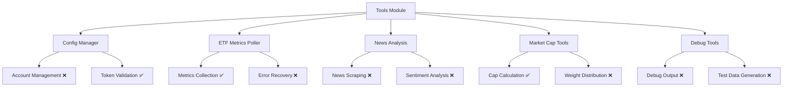
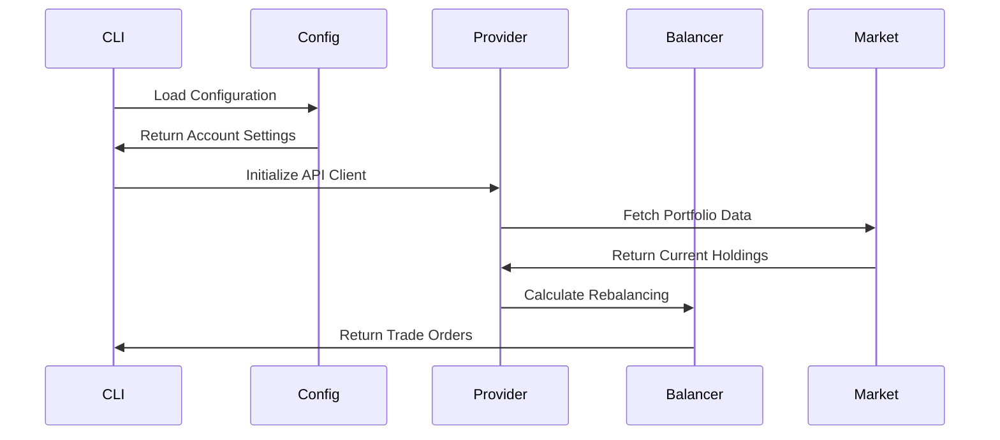

# Test Coverage Enhancement Design

## Overview

This design outlines comprehensive improvements to test coverage for the tinkoff-invest-etf-balancer-bot project. The project currently uses Bun.js as the test runner with Jest-compatible syntax and has established testing patterns, but requires systematic enhancement to achieve better coverage across all modules.

## Current Testing Architecture Analysis

### Existing Test Structure
```
src/__tests__/
├── __fixtures__/          # Test data fixtures
├── __mocks__/              # External dependency mocks
├── balancer/               # Balancer module tests
├── configLoader/           # Configuration tests
├── etfs/                   # ETF module tests
├── ha/                     # Heiken Ashi tests
├── integration/            # Integration tests
├── provider/               # Provider API tests
├── test-utils/             # Testing utilities
├── tools/                  # CLI tools tests
├── trader/                 # Trading logic tests
└── utils/                  # Utility function tests
```

### Testing Framework Configuration
- **Runtime**: Bun.js test runner
- **Syntax**: Jest-compatible
- **Timeout**: 10 seconds default
- **Coverage**: Basic coverage support (`bun test --coverage`)
- **Mocking**: Custom mock implementations for external dependencies

## Coverage Gaps Analysis

### High Priority Gaps

#### 1. Core Module Coverage Gaps
- **Entry Point** (`src/index.ts`): No dedicated tests
- **Type Definitions** (`src/types.d.ts`): Type validation tests missing
- **Test Setup** (`src/test-setup.ts`): Bootstrap testing missing

#### 2. Provider Module Enhancements
- Error handling scenarios incomplete
- Rate limiting behavior tests missing
- Authentication edge cases uncovered
- Real API response validation lacking

#### 3. Tools Module Coverage


#### 4. Error Handling and Edge Cases
- Network failure simulation
- Invalid configuration handling
- Market closure scenarios
- Rate limiting responses
- Data validation failures

### Medium Priority Gaps

#### 1. Integration Test Expansion
- End-to-end workflow testing
- Multi-account scenarios
- Configuration switching
- Error propagation chains

#### 2. Performance Testing
- Load testing for market data processing
- Memory usage validation
- Concurrent operation handling

## Enhanced Testing Strategy

### 1. Unit Testing Enhancement

#### Core Module Tests
```typescript
// src/__tests__/index.test.ts
describe('Application Entry Point', () => {
  describe('CLI Argument Processing', () => {
    it('should handle account selection arguments')
    it('should process dry-run mode flags')
    it('should validate configuration paths')
  })
  
  describe('Application Lifecycle', () => {
    it('should initialize components in correct order')
    it('should handle graceful shutdown')
    it('should cleanup resources on exit')
  })
})
```

#### Type Definition Validation
```typescript
// src/__tests__/types.test.ts
describe('Type Definitions', () => {
  describe('Configuration Types', () => {
    it('should validate AccountConfig structure')
    it('should enforce required fields')
    it('should handle optional margin settings')
  })
  
  describe('Market Data Types', () => {
    it('should validate Instrument interface')
    it('should handle price precision')
    it('should validate wallet structures')
  })
})
```

### 2. Provider Module Test Enhancement

#### API Client Testing
```typescript
describe('Provider API Client', () => {
  describe('Authentication', () => {
    it('should handle token expiration')
    it('should retry on authentication failures')
    it('should validate token format')
  })
  
  describe('Rate Limiting', () => {
    it('should implement exponential backoff')
    it('should respect API rate limits')
    it('should queue requests when rate limited')
  })
  
  describe('Error Recovery', () => {
    it('should handle network timeouts')
    it('should retry transient failures')
    it('should fail fast on permanent errors')
  })
})
```

### 3. Tools Module Comprehensive Testing

#### News Analysis Pipeline
```typescript
describe('News Analysis Tools', () => {
  describe('Web Scraping', () => {
    it('should extract ETF news from Tinkoff pages')
    it('should handle page structure changes')
    it('should validate scraped data format')
  })
  
  describe('Content Analysis', () => {
    it('should extract share count changes')
    it('should identify dividend announcements')
    it('should categorize news by impact level')
  })
})
```

#### Configuration Management
```typescript
describe('Configuration Manager', () => {
  describe('Account Operations', () => {
    it('should add new accounts with validation')
    it('should update existing account settings')
    it('should remove accounts safely')
  })
  
  describe('Token Management', () => {
    it('should encrypt stored tokens')
    it('should validate token permissions')
    it('should handle environment variable expansion')
  })
})
```

### 4. Integration Testing Framework

#### Workflow Integration Tests


#### Multi-Account Scenarios
```typescript
describe('Multi-Account Integration', () => {
  it('should handle concurrent account processing')
  it('should isolate account configurations')
  it('should aggregate results across accounts')
  it('should handle partial failures gracefully')
})
```

## Test Data Management

### Fixture Enhancement Strategy

#### Market Data Fixtures
```typescript
// src/__tests__/__fixtures__/market-data.ts
export const marketDataFixtures = {
  instruments: {
    complete: [], // Full instrument set
    minimal: [],  // Minimal test set
    edge_cases: [] // Edge case instruments
  },
  prices: {
    normal: {},     // Standard price data
    extreme: {},    // Edge case pricing
    missing: {}     // Incomplete data
  },
  portfolios: {
    balanced: {},   // Standard portfolio
    concentrated: {}, // Single position
    empty: {}       // No holdings
  }
}
```

#### Configuration Fixtures
```typescript
// Enhanced configuration test data
export const configurationFixtures = {
  accounts: {
    basic: {},
    withMargin: {},
    multiStrategy: {},
    invalidToken: {},
    missingFields: {}
  },
  strategies: {
    equalWeight: {},
    marketCap: {},
    decorrelation: {},
    custom: {}
  }
}
```

### Mock Enhancement Strategy

#### External Service Mocks
```typescript
// Enhanced Tinkoff SDK mock
export class EnhancedTinkoffMock {
  // Realistic response simulation
  simulateLatency(min: number, max: number): Promise<void>
  
  // Error scenario simulation
  simulateNetworkError(): void
  simulateRateLimit(): void
  simulateAuthFailure(): void
  
  // Market condition simulation
  simulateMarketClosure(): void
  simulateVolatility(): void
  simulateDataUnavailable(): void
}
```

## Testing Utilities Enhancement

### Advanced Test Helpers

#### Financial Assertion Library
```typescript
export class FinancialAssertions {
  static expectPortfolioBalance(portfolio: Portfolio, tolerance: number): void
  static expectPriceWithinRange(price: Price, min: number, max: number): void
  static expectOrderValidation(order: Order): void
  static expectMarginCompliance(position: Position, rules: MarginRules): void
}
```

#### Test Environment Management
```typescript
export class TestEnvironment {
  static setupMarketData(): void
  static mockExchangeSchedule(): void
  static simulateMarketConditions(scenario: MarketScenario): void
  static cleanupTestData(): void
}
```

## Coverage Measurement and Reporting

### Coverage Targets

| Module | Current | Target | Priority |
|--------|---------|--------|----------|
| Core Entry Point | 0% | 90% | High |
| Configuration | 70% | 95% | High |
| Provider API | 60% | 90% | High |
| Balancer Logic | 80% | 95% | Medium |
| Tools | 40% | 85% | Medium |
| Utils | 85% | 95% | Low |

### Coverage Metrics Strategy

#### Line Coverage Enhancement
- Target 90% line coverage across core modules
- Identify and test critical error paths
- Ensure all public API endpoints are tested

#### Branch Coverage Implementation
```bash
# Enhanced coverage reporting
bun test --coverage --coverage-threshold=90
bun test --coverage --reporter=lcov
bun test --coverage --reporter=html
```

#### Function Coverage Validation
- Test all exported functions
- Validate private method behavior through public interfaces
- Ensure async function error handling

## Error Scenario Testing

### Network and API Error Simulation

#### Failure Mode Testing
```typescript
describe('Error Resilience', () => {
  describe('Network Failures', () => {
    it('should handle connection timeouts')
    it('should recover from temporary outages')
    it('should maintain data consistency during failures')
  })
  
  describe('API Errors', () => {
    it('should handle invalid responses')
    it('should manage rate limit violations')
    it('should process authentication errors')
  })
})
```

### Data Validation Testing

#### Input Validation
```typescript
describe('Data Validation', () => {
  describe('Configuration Validation', () => {
    it('should reject invalid account configurations')
    it('should validate token formats')
    it('should enforce required fields')
  })
  
  describe('Market Data Validation', () => {
    it('should handle malformed price data')
    it('should validate instrument information')
    it('should process incomplete portfolio data')
  })
})
```

## Performance Testing Integration

### Load Testing Strategy

#### Market Data Processing
```typescript
describe('Performance Tests', () => {
  describe('Market Data Processing', () => {
    it('should process large portfolios efficiently')
    it('should handle concurrent API requests')
    it('should maintain performance under load')
  })
})
```

#### Memory Usage Validation
```typescript
describe('Memory Management', () => {
  it('should not leak memory during long operations')
  it('should manage large datasets efficiently')
  it('should cleanup resources properly')
})
```

## Implementation Roadmap

### Phase 1: Core Module Testing (Week 1-2)
1. Implement entry point tests
2. Add type definition validation
3. Enhance configuration testing
4. Expand provider module tests

### Phase 2: Tools and Integration (Week 3-4)
1. Complete tools module testing
2. Add comprehensive integration tests
3. Implement error scenario testing
4. Enhance test fixtures and mocks

### Phase 3: Advanced Testing (Week 5-6)
1. Add performance testing suite
2. Implement coverage monitoring
3. Add visual regression testing for CLI output
4. Create automated test reporting

### Phase 4: Continuous Integration (Week 7-8)
1. Set up automated coverage reporting
2. Implement test quality gates
3. Add mutation testing
4. Create test documentation

## Test Execution Strategy

### Local Development
```bash
# Development test workflow
bun test --watch                    # Continuous testing
bun test --coverage                 # Coverage analysis
bun test src/__tests__/provider/    # Module-specific testing
bun test --timeout 30000           # Extended timeout for integration
```

### Continuous Integration
```bash
# CI/CD pipeline tests
bun test --reporter junit           # CI-compatible reporting
bun test --coverage --threshold 90  # Quality gate enforcement
bun test --maxWorkers 50%          # Resource-conscious execution
```

### Test Categories
- **Unit Tests**: Fast, isolated component testing
- **Integration Tests**: Multi-component interaction validation
- **End-to-End Tests**: Complete workflow verification
- **Performance Tests**: Load and stress testing
- **Error Tests**: Failure scenario validation    E --> E2[Weight Distribution ❌]
    F --> F1[Debug Output ❌]
    F --> F2[Test Data Generation ❌]
```

#### 4. Error Handling and Edge Cases
- Network failure simulation
- Invalid configuration handling
- Market closure scenarios
- Rate limiting responses
- Data validation failures

### Medium Priority Gaps

#### 1. Integration Test Expansion
- End-to-end workflow testing
- Multi-account scenarios
- Configuration switching
- Error propagation chains

#### 2. Performance Testing
- Load testing for market data processing
- Memory usage validation
- Concurrent operation handling

## Enhanced Testing Strategy

### 1. Unit Testing Enhancement

#### Core Module Tests
```typescript
// src/__tests__/index.test.ts
describe('Application Entry Point', () => {
  describe('CLI Argument Processing', () => {
    it('should handle account selection arguments')
    it('should process dry-run mode flags')
    it('should validate configuration paths')
  })
  
  describe('Application Lifecycle', () => {
    it('should initialize components in correct order')
    it('should handle graceful shutdown')
    it('should cleanup resources on exit')
  })
})
```

#### Type Definition Validation
```typescript
// src/__tests__/types.test.ts
describe('Type Definitions', () => {
  describe('Configuration Types', () => {
    it('should validate AccountConfig structure')
    it('should enforce required fields')
    it('should handle optional margin settings')
  })
  
  describe('Market Data Types', () => {
    it('should validate Instrument interface')
    it('should handle price precision')
    it('should validate wallet structures')
  })
})
```

### 2. Provider Module Test Enhancement

#### API Client Testing
```typescript
describe('Provider API Client', () => {
  describe('Authentication', () => {
    it('should handle token expiration')
    it('should retry on authentication failures')
    it('should validate token format')
  })
  
  describe('Rate Limiting', () => {
    it('should implement exponential backoff')
    it('should respect API rate limits')
    it('should queue requests when rate limited')
  })
  
  describe('Error Recovery', () => {
    it('should handle network timeouts')
    it('should retry transient failures')
    it('should fail fast on permanent errors')
  })
})
```

### 3. Tools Module Comprehensive Testing

#### News Analysis Pipeline
```typescript
describe('News Analysis Tools', () => {
  describe('Web Scraping', () => {
    it('should extract ETF news from Tinkoff pages')
    it('should handle page structure changes')
    it('should validate scraped data format')
  })
  
  describe('Content Analysis', () => {
    it('should extract share count changes')
    it('should identify dividend announcements')
    it('should categorize news by impact level')
  })
})
```

#### Configuration Management
```typescript
describe('Configuration Manager', () => {
  describe('Account Operations', () => {
    it('should add new accounts with validation')
    it('should update existing account settings')
    it('should remove accounts safely')
  })
  
  describe('Token Management', () => {
    it('should encrypt stored tokens')
    it('should validate token permissions')
    it('should handle environment variable expansion')
  })
})
```

### 4. Integration Testing Framework

#### Workflow Integration Tests


#### Multi-Account Scenarios
```typescript
describe('Multi-Account Integration', () => {
  it('should handle concurrent account processing')
  it('should isolate account configurations')
  it('should aggregate results across accounts')
  it('should handle partial failures gracefully')
})
```

## Test Data Management

### Fixture Enhancement Strategy

#### Market Data Fixtures
```typescript
// src/__tests__/__fixtures__/market-data.ts
export const marketDataFixtures = {
  instruments: {
    complete: [], // Full instrument set
    minimal: [],  // Minimal test set
    edge_cases: [] // Edge case instruments
  },
  prices: {
    normal: {},     // Standard price data
    extreme: {},    // Edge case pricing
    missing: {}     // Incomplete data
  },
  portfolios: {
    balanced: {},   // Standard portfolio
    concentrated: {}, // Single position
    empty: {}       // No holdings
  }
}
```

#### Configuration Fixtures
```typescript
// Enhanced configuration test data
export const configurationFixtures = {
  accounts: {
    basic: {},
    withMargin: {},
    multiStrategy: {},
    invalidToken: {},
    missingFields: {}
  },
  strategies: {
    equalWeight: {},
    marketCap: {},
    decorrelation: {},
    custom: {}
  }
}
```

### Mock Enhancement Strategy

#### External Service Mocks
```typescript
// Enhanced Tinkoff SDK mock
export class EnhancedTinkoffMock {
  // Realistic response simulation
  simulateLatency(min: number, max: number): Promise<void>
  
  // Error scenario simulation
  simulateNetworkError(): void
  simulateRateLimit(): void
  simulateAuthFailure(): void
  
  // Market condition simulation
  simulateMarketClosure(): void
  simulateVolatility(): void
  simulateDataUnavailable(): void
}
```

## Testing Utilities Enhancement

### Advanced Test Helpers

#### Financial Assertion Library
```typescript
export class FinancialAssertions {
  static expectPortfolioBalance(portfolio: Portfolio, tolerance: number): void
  static expectPriceWithinRange(price: Price, min: number, max: number): void
  static expectOrderValidation(order: Order): void
  static expectMarginCompliance(position: Position, rules: MarginRules): void
}
```

#### Test Environment Management
```typescript
export class TestEnvironment {
  static setupMarketData(): void
  static mockExchangeSchedule(): void
  static simulateMarketConditions(scenario: MarketScenario): void
  static cleanupTestData(): void
}
```

## Coverage Measurement and Reporting

### Coverage Targets

| Module | Current | Target | Priority |
|--------|---------|--------|----------|
| Core Entry Point | 0% | 90% | High |
| Configuration | 70% | 95% | High |
| Provider API | 60% | 90% | High |
| Balancer Logic | 80% | 95% | Medium |
| Tools | 40% | 85% | Medium |
| Utils | 85% | 95% | Low |

### Coverage Metrics Strategy

#### Line Coverage Enhancement
- Target 90% line coverage across core modules
- Identify and test critical error paths
- Ensure all public API endpoints are tested

#### Branch Coverage Implementation
```bash
# Enhanced coverage reporting
bun test --coverage --coverage-threshold=90
bun test --coverage --reporter=lcov
bun test --coverage --reporter=html
```

#### Function Coverage Validation
- Test all exported functions
- Validate private method behavior through public interfaces
- Ensure async function error handling

## Error Scenario Testing

### Network and API Error Simulation

#### Failure Mode Testing
```typescript
describe('Error Resilience', () => {
  describe('Network Failures', () => {
    it('should handle connection timeouts')
    it('should recover from temporary outages')
    it('should maintain data consistency during failures')
  })
  
  describe('API Errors', () => {
    it('should handle invalid responses')
    it('should manage rate limit violations')
    it('should process authentication errors')
  })
})
```

### Data Validation Testing

#### Input Validation
```typescript
describe('Data Validation', () => {
  describe('Configuration Validation', () => {
    it('should reject invalid account configurations')
    it('should validate token formats')
    it('should enforce required fields')
  })
  
  describe('Market Data Validation', () => {
    it('should handle malformed price data')
    it('should validate instrument information')
    it('should process incomplete portfolio data')
  })
})
```

## Performance Testing Integration

### Load Testing Strategy

#### Market Data Processing
```typescript
describe('Performance Tests', () => {
  describe('Market Data Processing', () => {
    it('should process large portfolios efficiently')
    it('should handle concurrent API requests')
    it('should maintain performance under load')
  })
})
```

#### Memory Usage Validation
```typescript
describe('Memory Management', () => {
  it('should not leak memory during long operations')
  it('should manage large datasets efficiently')
  it('should cleanup resources properly')
})
```

## Implementation Roadmap

### Phase 1: Core Module Testing (Week 1-2)
1. Implement entry point tests
2. Add type definition validation
3. Enhance configuration testing
4. Expand provider module tests

### Phase 2: Tools and Integration (Week 3-4)
1. Complete tools module testing
2. Add comprehensive integration tests
3. Implement error scenario testing
4. Enhance test fixtures and mocks

### Phase 3: Advanced Testing (Week 5-6)
1. Add performance testing suite
2. Implement coverage monitoring
3. Add visual regression testing for CLI output
4. Create automated test reporting

### Phase 4: Continuous Integration (Week 7-8)
1. Set up automated coverage reporting
2. Implement test quality gates
3. Add mutation testing
4. Create test documentation

## Test Execution Strategy

### Local Development
```bash
# Development test workflow
bun test --watch                    # Continuous testing
bun test --coverage                 # Coverage analysis
bun test src/__tests__/provider/    # Module-specific testing
bun test --timeout 30000           # Extended timeout for integration
```

### Continuous Integration
```bash
# CI/CD pipeline tests
bun test --reporter junit           # CI-compatible reporting
bun test --coverage --threshold 90  # Quality gate enforcement
bun test --maxWorkers 50%          # Resource-conscious execution
```

### Test Categories
- **Unit Tests**: Fast, isolated component testing
- **Integration Tests**: Multi-component interaction validation
- **End-to-End Tests**: Complete workflow verification
- **Performance Tests**: Load and stress testing
- **Error Tests**: Failure scenario validation


