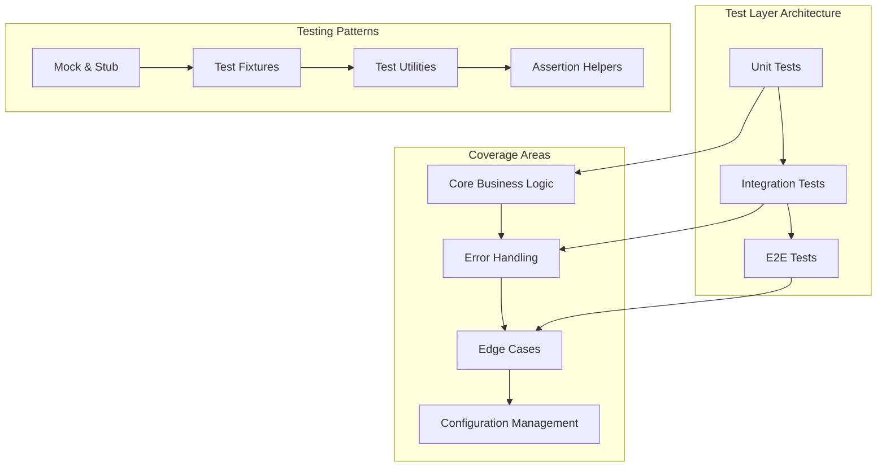
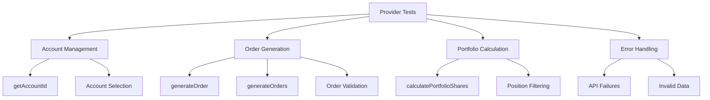
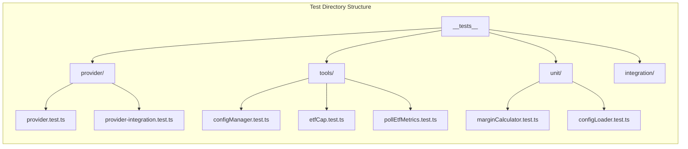
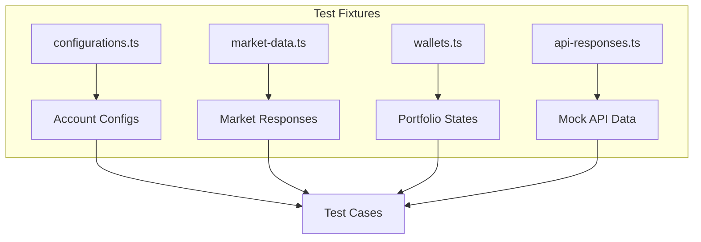
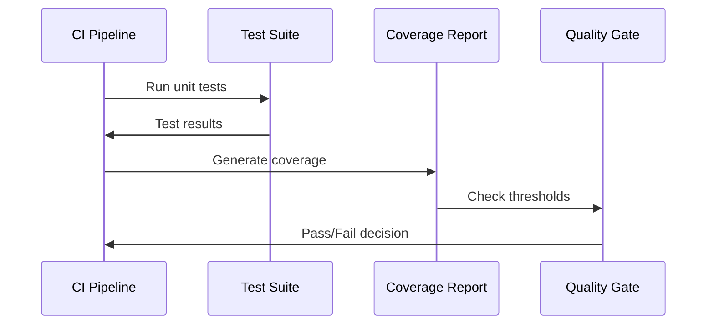

# Test Coverage Improvement Design

## Overview

This design outlines a comprehensive strategy to improve test coverage from the current 65.85% to 80%+ for the tinkoff-invest-etf-balancer-bot project. The focus is on covering critical business logic, error handling, and edge cases while maintaining practical testing approaches.

## Current Coverage Analysis

### Critical Low Coverage Areas

| Module | Current Coverage | Target Coverage | Priority |
|--------|------------------|-----------------|----------|
| src/provider/index.ts | 5.59% | 85% | High |
| src/tools/configManager.ts | 1.28% | 80% | High |
| src/tools/etfCap.ts | 11.05% | 75% | High |
| src/tools/pollEtfMetrics.ts | 8.79% | 70% | Medium |
| src/configLoader.ts | 74.26% | 85% | Medium |
| src/utils/marginCalculator.ts | 69.23% | 85% | Medium |

### Files Excluded from Coverage Targets
- `src/__tests__/__mocks__/tinkoff-sdk.ts` (external SDK mock)
- `src/__tests__/__mocks__/external-deps.ts` (external dependencies mock)

## Testing Strategy Architecture

## Component-Specific Testing Plans

### 1. Provider Module (`src/provider/index.ts`)

**Current Issues:**
- 5.59% coverage with 508 uncovered lines
- Core trading functionality untested
- API integration logic missing tests

**Testing Strategy:**

**Test Cases to Implement:**
- Account ID resolution (string, index, type-based)
- Portfolio shares calculation with various wallet configurations
- Order generation for buy/sell operations
- Order validation and lot calculations
- Error handling for API failures
- Currency position filtering
- Market order creation and execution

### 2. Configuration Manager (`src/tools/configManager.ts`)

**Current Issues:**
- 1.28% coverage with 258 uncovered lines
- Critical configuration management untested

**Testing Strategy:**
- Configuration validation logic
- Account information display
- Token resolution (environment vs direct)
- Error handling for missing accounts
- Environment setup validation
- Help system functionality

### 3. ETF Market Cap Tool (`src/tools/etfCap.ts`)

**Current Issues:**
- 11.05% coverage with 410 uncovered lines
- Web scraping and data processing untested

**Testing Strategy:**
- HTML parsing logic with mock responses
- AUM data extraction from T-Capital
- Market cap calculations
- Currency conversion logic
- Error handling for network failures
- Ticker normalization

### 4. ETF Metrics Polling (`src/tools/pollEtfMetrics.ts`)

**Current Issues:**
- 8.79% coverage with 347 uncovered lines
- Data collection and processing untested

**Testing Strategy:**
- Smartfeed API interaction with mocked responses
- Shares count extraction from news
- Metrics file management
- URL generation and validation
- Error handling for API failures

## Test Implementation Architecture

### Test Organization Structure

### Mock Strategy

**External Dependencies:**
- Tinkoff SDK API calls → Mock with realistic responses
- Network requests → Mock with request-promise stub
- File system operations → Mock with in-memory alternatives
- Environment variables → Mock with test configurations

**Test Data Fixtures:**
- Sample account configurations
- Mock market data responses
- Simulated portfolio states
- Error response scenarios

### Test Utilities Enhancement

**Current test-utils enhancements needed:**
- Account configuration builders
- Mock API response generators
- Portfolio state simulators
- Error scenario helpers

## Coverage Targets by Module

### High Priority Modules (Target: 85%+)

**Provider Module:**
- Account management: 90%
- Order generation: 85%
- Portfolio calculations: 90%
- Error handling: 80%

**Config Loader:**
- Configuration loading: 90%
- Validation logic: 85%
- Error handling: 80%

### Medium Priority Modules (Target: 75-80%)

**Configuration Manager:**
- Account operations: 80%
- Token management: 75%
- Display functions: 70%

**ETF Cap Tool:**
- Data parsing: 75%
- API integration: 70%
- Calculations: 80%

**Margin Calculator:**
- Calculation logic: 85%
- Validation: 80%
- Edge cases: 75%

### Lower Priority Modules (Target: 70%)

**ETF Metrics Polling:**
- Core functionality: 70%
- Error handling: 65%
- File operations: 60%

## Test Data Management

### Fixture Organization

### Mock Data Strategy

**Configuration Fixtures:**
- Valid account configurations
- Invalid configuration scenarios
- Environment variable scenarios
- Multi-account setups

**Market Data Fixtures:**
- Realistic instrument data
- Price information
- Portfolio positions
- Order responses

## Error Handling Test Coverage

### Error Scenarios by Module

**Provider Module:**
- Network failures during API calls
- Invalid account IDs
- Malformed instrument data
- Order placement failures

**Configuration Module:**
- Missing configuration files
- Invalid JSON format
- Missing environment variables
- Duplicate account IDs

**Tools Modules:**
- Web scraping failures
- File system errors
- Invalid data formats
- API rate limiting

## Integration Testing Strategy

### API Integration Tests

**Tinkoff SDK Integration:**
- Mock SDK responses for realistic scenarios
- Test error propagation
- Validate data transformation

**External Service Integration:**
- Mock T-Capital website responses
- Test web scraping resilience
- Validate data extraction

### Configuration Integration Tests

**Multi-Account Scenarios:**
- Account switching logic
- Token resolution across accounts
- Configuration inheritance

## Performance Testing Considerations

### Load Testing Scenarios

**Provider Operations:**
- Multiple concurrent order generation
- Large portfolio processing
- Bulk position calculations

**Data Processing:**
- Large market data sets
- Complex ETF metrics processing
- Concurrent file operations

## Implementation Roadmap

### Phase 1: Core Provider Testing (Week 1)
- Implement provider module tests
- Add account management tests
- Create order generation tests
- Target: Provider module to 85%

### Phase 2: Configuration & Tools (Week 2)
- Implement configuration manager tests
- Add config loader edge case tests
- Create ETF cap tool tests
- Target: Config modules to 80%

### Phase 3: Utilities & Integration (Week 3)
- Enhance margin calculator tests
- Add metrics polling tests
- Implement integration test scenarios
- Target: Overall coverage to 80%

### Phase 4: Optimization & Edge Cases (Week 4)
- Add comprehensive error handling tests
- Implement performance test scenarios
- Optimize test execution speed
- Target: Stable 80%+ coverage

## Test Execution Strategy

### Continuous Integration

**Test Execution Pipeline:**

### Coverage Monitoring

**Quality Gates:**
- Minimum 80% line coverage
- Minimum 75% function coverage
- No decrease in coverage on new commits
- Critical modules maintain 85%+ coverage

### Test Performance

**Execution Optimization:**
- Parallel test execution where possible
- Mock external dependencies completely
- Use in-memory alternatives for file operations
- Optimize test data fixtures

## Maintenance Strategy

### Coverage Sustainability

**Code Review Process:**
- Mandatory tests for new features
- Coverage impact assessment
- Test quality validation

**Monitoring & Alerts:**
- Coverage degradation alerts
- Failed test notifications
- Performance regression detection

### Test Quality Metrics

**Beyond Coverage:**
- Test reliability (flakiness detection)
- Test execution time
- Test maintenance burden
- Bug detection effectiveness
**Current Issues:**
- 1.28% coverage with 258 uncovered lines
- Critical configuration management untested

**Testing Strategy:**
- Configuration validation logic
- Account information display
- Token resolution (environment vs direct)
- Error handling for missing accounts
- Environment setup validation
- Help system functionality

### 3. ETF Market Cap Tool (`src/tools/etfCap.ts`)

**Current Issues:**
- 11.05% coverage with 410 uncovered lines
- Web scraping and data processing untested

**Testing Strategy:**
- HTML parsing logic with mock responses
- AUM data extraction from T-Capital
- Market cap calculations
- Currency conversion logic
- Error handling for network failures
- Ticker normalization

### 4. ETF Metrics Polling (`src/tools/pollEtfMetrics.ts`)

**Current Issues:**
- 8.79% coverage with 347 uncovered lines
- Data collection and processing untested

**Testing Strategy:**
- Smartfeed API interaction with mocked responses
- Shares count extraction from news
- Metrics file management
- URL generation and validation
- Error handling for API failures

## Test Implementation Architecture

### Test Organization Structure

### Mock Strategy

**External Dependencies:**
- Tinkoff SDK API calls → Mock with realistic responses
- Network requests → Mock with request-promise stub
- File system operations → Mock with in-memory alternatives
- Environment variables → Mock with test configurations

**Test Data Fixtures:**
- Sample account configurations
- Mock market data responses
- Simulated portfolio states
- Error response scenarios

### Test Utilities Enhancement

**Current test-utils enhancements needed:**
- Account configuration builders
- Mock API response generators
- Portfolio state simulators
- Error scenario helpers

## Coverage Targets by Module

### High Priority Modules (Target: 85%+)

**Provider Module:**
- Account management: 90%
- Order generation: 85%
- Portfolio calculations: 90%
- Error handling: 80%

**Config Loader:**
- Configuration loading: 90%
- Validation logic: 85%
- Error handling: 80%

### Medium Priority Modules (Target: 75-80%)

**Configuration Manager:**
- Account operations: 80%
- Token management: 75%
- Display functions: 70%

**ETF Cap Tool:**
- Data parsing: 75%
- API integration: 70%
- Calculations: 80%

**Margin Calculator:**
- Calculation logic: 85%
- Validation: 80%
- Edge cases: 75%

### Lower Priority Modules (Target: 70%)

**ETF Metrics Polling:**
- Core functionality: 70%
- Error handling: 65%
- File operations: 60%

## Test Data Management

### Fixture Organization

### Mock Data Strategy

**Configuration Fixtures:**
- Valid account configurations
- Invalid configuration scenarios
- Environment variable scenarios
- Multi-account setups

**Market Data Fixtures:**
- Realistic instrument data
- Price information
- Portfolio positions
- Order responses

## Error Handling Test Coverage

### Error Scenarios by Module

**Provider Module:**
- Network failures during API calls
- Invalid account IDs
- Malformed instrument data
- Order placement failures

**Configuration Module:**
- Missing configuration files
- Invalid JSON format
- Missing environment variables
- Duplicate account IDs

**Tools Modules:**
- Web scraping failures
- File system errors
- Invalid data formats
- API rate limiting

## Integration Testing Strategy

### API Integration Tests

**Tinkoff SDK Integration:**
- Mock SDK responses for realistic scenarios
- Test error propagation
- Validate data transformation

**External Service Integration:**
- Mock T-Capital website responses
- Test web scraping resilience
- Validate data extraction

### Configuration Integration Tests

**Multi-Account Scenarios:**
- Account switching logic
- Token resolution across accounts
- Configuration inheritance

## Performance Testing Considerations

### Load Testing Scenarios

**Provider Operations:**
- Multiple concurrent order generation
- Large portfolio processing
- Bulk position calculations

**Data Processing:**
- Large market data sets
- Complex ETF metrics processing
- Concurrent file operations

## Implementation Roadmap

### Phase 1: Core Provider Testing (Week 1)
- Implement provider module tests
- Add account management tests
- Create order generation tests
- Target: Provider module to 85%

### Phase 2: Configuration & Tools (Week 2)
- Implement configuration manager tests
- Add config loader edge case tests
- Create ETF cap tool tests
- Target: Config modules to 80%

### Phase 3: Utilities & Integration (Week 3)
- Enhance margin calculator tests
- Add metrics polling tests
- Implement integration test scenarios
- Target: Overall coverage to 80%

### Phase 4: Optimization & Edge Cases (Week 4)
- Add comprehensive error handling tests
- Implement performance test scenarios
- Optimize test execution speed
- Target: Stable 80%+ coverage

## Test Execution Strategy

### Continuous Integration

**Test Execution Pipeline:**

### Coverage Monitoring

**Quality Gates:**
- Minimum 80% line coverage
- Minimum 75% function coverage
- No decrease in coverage on new commits
- Critical modules maintain 85%+ coverage

### Test Performance

**Execution Optimization:**
- Parallel test execution where possible
- Mock external dependencies completely
- Use in-memory alternatives for file operations
- Optimize test data fixtures

## Maintenance Strategy

### Coverage Sustainability

**Code Review Process:**
- Mandatory tests for new features
- Coverage impact assessment
- Test quality validation

**Monitoring & Alerts:**
- Coverage degradation alerts
- Failed test notifications
- Performance regression detection

### Test Quality Metrics

**Beyond Coverage:**
- Test reliability (flakiness detection)
- Test execution time
- Test maintenance burden
- Bug detection effectiveness

