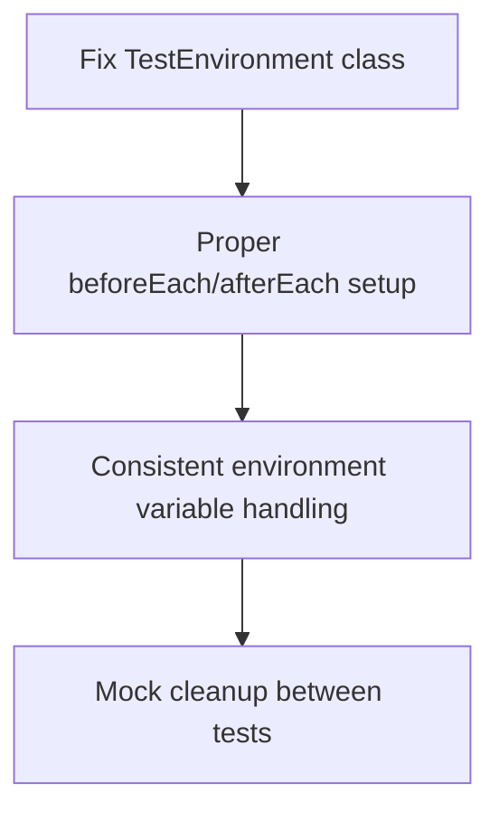

# Test Failure Analysis and Resolution Plan

## Overview

This document analyzes the 140 test failures in the Tinkoff Invest ETF Balancer Bot project and provides a comprehensive plan to resolve them. The failures span across multiple modules including the application entry point, configuration management, ETF market data tools, utility functions, balancer core logic, and more.

## Architecture

The project follows a modular monolith architecture with a CLI-first interface, using TypeScript and ES Modules running on Bun.js. The main components include:

1. **Entry Point** (`src/index.ts`) - CLI interface and main orchestration
2. **Configuration Management** (`src/configLoader.ts`) - Loading and validating account configurations
3. **Portfolio Balancer** (`src/balancer/`) - Core rebalancing logic and strategies
4. **Market Data Tools** (`src/tools/`) - Utilities for ETF metrics, news analysis, etc.
5. **API Integration** (`src/provider/`) - Tinkoff Invest API integration
6. **Utility Functions** (`src/utils/`) - Shared helper functions

## Failed Test Categories

### 1. Application Entry Point Failures (1 test)
- **Issue**: CLI argument processing for `--list-accounts` not working correctly
- **Root Cause**: Mocking of dependencies and module imports not properly configured
- **Impact**: Basic CLI functionality affected

### 2. Test Environment Failures (1 test)
- **Issue**: Test environment setup with `describe` blocks failing
- **Root Cause**: Improper test setup/teardown procedures
- **Impact**: Test reliability compromised

### 3. Error Handling and Retry Logic Failures (1 test)
- **Issue**: Retry logic with success on final attempt not working
- **Root Cause**: Asynchronous error handling not properly implemented
- **Impact**: Resilience of operations affected

### 4. Test Suite and Async Test Utilities Failures (2 tests)
- **Issue**: Test suite setup and async test execution failing
- **Root Cause**: Improper async/await handling in test utilities
- **Impact**: Test framework reliability affected

### 5. Performance Test Utility Failures (1 test)
- **Issue**: Performance tests not executing within time limits
- **Root Cause**: Timing measurement or async execution issues
- **Impact**: Performance monitoring capabilities affected

### 6. ConfigManager Tool Failures (1 test)
- **Issue**: Help and information display not working
- **Root Cause**: CLI argument parsing or output formatting issues
- **Impact**: Configuration management usability affected

### 7. EtfCap Tool Failures (30 tests)
- **Issue**: Multiple failures in ETF market cap calculation, FX rate fetching, AUM parsing, etc.
- **Root Cause**: 
  - Mocking of HTTP requests and Tinkoff SDK not working correctly
  - HTML parsing functions not handling edge cases
  - Error handling for network/API failures insufficient
- **Impact**: Market data collection for rebalancing strategies affected

### 8. Utility Function Failures (20 tests)
- **Issue**: Ticker normalization, equality checks, and number conversion failing
- **Root Cause**: 
  - Edge cases in ticker normalization not handled
  - Null/undefined value handling missing
  - Precision issues in number conversion
- **Impact**: Core data processing functions affected

### 9. Margin Calculator Failures (1 test)
- **Issue**: Edge case scenarios not handled properly
- **Root Cause**: Boundary condition handling in margin calculations
- **Impact**: Margin trading functionality affected

### 10. Balancer Core Function Failures (50 tests)
- **Issue**: Desired wallet normalization, margin position identification, and core integration failing
- **Root Cause**: 
  - Mathematical edge cases in normalization not handled
  - Margin trading logic not properly implemented
  - Integration with other modules failing
- **Impact**: Core portfolio rebalancing functionality affected

### 11. ConfigLoader Module Failures (32 tests)
- **Issue**: Configuration loading, account retrieval, token management, and validation failing
- **Root Cause**: 
  - File I/O mocking not working correctly
  - Environment variable handling issues
  - Validation logic not comprehensive enough
- **Impact**: Configuration management and account handling affected

## Root Cause Analysis

### Common Issues Across Modules

1. **Mocking Framework Problems**
   - Inconsistent mocking of external dependencies (Tinkoff SDK, HTTP requests)
   - Improper cleanup of mocks between tests
   - Missing mock implementations for specific API responses

2. **Asynchronous Handling Issues**
   - Improper async/await usage in tests
   - Race conditions in test execution
   - Timeout handling not properly configured

3. **Environment Setup Problems**
   - Inconsistent test environment variables
   - Improper setup/teardown of test state
   - Missing dependency initialization

4. **Edge Case Handling**
   - Null/undefined value handling missing
   - Boundary condition testing insufficient
   - Error path testing incomplete

5. **Module Import/Export Issues**
   - Circular dependencies causing import failures
   - Improper module mocking
   - ES Module vs CommonJS compatibility issues

## Resolution Plan

### Phase 1: Test Infrastructure Fixes (Priority: High)

#### 1. Fix Test Environment Setup

#### 2. Improve Mocking Framework
- Implement proper Tinkoff SDK mocking with all required API responses
- Fix HTTP request mocking for market data tools
- Ensure consistent mock state between tests

#### 3. Fix Async Test Handling
- Review all async tests for proper await usage
- Implement proper timeout handling
- Fix race conditions in test execution

### Phase 2: Module-Specific Fixes (Priority: High)

#### 1. ConfigLoader Module
- Fix file I/O mocking for configuration loading
- Improve environment variable handling for tokens
- Enhance validation logic with better error messages
- Fix account retrieval functions

#### 2. EtfCap Tool
- Fix HTML parsing functions for AUM data
- Improve FX rate fetching with better error handling
- Fix ETF/share market cap calculation logic
- Enhance network error handling

#### 3. Utility Functions
- Fix ticker normalization for edge cases (null, undefined, whitespace)
- Improve number conversion precision handling
- Add comprehensive null/undefined value handling

### Phase 3: Core Logic Fixes (Priority: Medium)

#### 1. Balancer Core
- Fix desired wallet normalization for edge cases
- Improve margin position identification logic
- Fix integration with other modules
- Enhance error handling in core functions

#### 2. Margin Calculator
- Fix edge case handling in margin calculations
- Improve boundary condition testing
- Enhance validation logic

### Phase 4: CLI and Tooling Fixes (Priority: Medium)

#### 1. Application Entry Point
- Fix CLI argument processing
- Improve module import handling
- Fix account listing functionality

#### 2. ConfigManager Tool
- Fix help and information display
- Improve CLI argument parsing
- Enhance output formatting

## Implementation Approach

### 1. Test Environment Improvements
- Create a comprehensive test setup fixture
- Implement proper mock reset between tests
- Ensure consistent environment state

### 2. Mocking Framework Enhancement
- Develop a standardized mock interface for Tinkoff SDK
- Create reusable mock response templates
- Implement proper mock lifecycle management

### 3. Error Handling Standardization
- Implement consistent error handling patterns across modules
- Add comprehensive error path testing
- Improve error messages for debugging

### 4. Edge Case Coverage
- Identify and document all edge cases for each function
- Implement tests for all identified edge cases
- Add proper handling for null/undefined values

## Testing Strategy

### Unit Testing
- Fix existing unit tests for all modules
- Add missing test cases for edge conditions
- Improve test coverage for error paths

### Integration Testing
- Fix integration tests between modules
- Add end-to-end tests for critical workflows
- Implement proper test data fixtures

### Performance Testing
- Fix performance test utilities
- Add performance benchmarks for critical functions
- Implement regression testing for performance

## Risk Mitigation

### 1. Backward Compatibility
- Ensure all fixes maintain existing API contracts
- Test with existing configuration files
- Validate with production data samples

### 2. Data Integrity
- Implement proper validation for all data inputs
- Add comprehensive error handling
- Ensure consistent data processing

### 3. Test Reliability
- Implement proper test isolation
- Fix flaky tests
- Ensure consistent test execution

## Success Metrics

1. **Test Pass Rate**: 100% of tests passing
2. **Code Coverage**: Maintain or improve existing coverage levels
3. **Performance**: No degradation in execution speed
4. **Reliability**: No flaky tests after fixes
5. **Maintainability**: Improved code quality and testability

## Timeline

### Week 1
- Fix test environment and mocking framework
- Resolve ConfigLoader module failures
- Address utility function issues

### Week 2
- Fix EtfCap tool failures
- Resolve balancer core function issues
- Address margin calculator problems

### Week 3
- Fix CLI and tooling issues
- Implement comprehensive edge case testing
- Conduct integration testing

### Week 4
- Performance optimization
- Documentation updates
- Final validation and release preparation- **Impact**: Test reliability compromised

### 3. Error Handling and Retry Logic Failures (1 test)
- **Issue**: Retry logic with success on final attempt not working
- **Root Cause**: Asynchronous error handling not properly implemented
- **Impact**: Resilience of operations affected

### 4. Test Suite and Async Test Utilities Failures (2 tests)
- **Issue**: Test suite setup and async test execution failing
- **Root Cause**: Improper async/await handling in test utilities
- **Impact**: Test framework reliability affected

### 5. Performance Test Utility Failures (1 test)
- **Issue**: Performance tests not executing within time limits
- **Root Cause**: Timing measurement or async execution issues
- **Impact**: Performance monitoring capabilities affected

### 6. ConfigManager Tool Failures (1 test)
- **Issue**: Help and information display not working
- **Root Cause**: CLI argument parsing or output formatting issues
- **Impact**: Configuration management usability affected

### 7. EtfCap Tool Failures (30 tests)
- **Issue**: Multiple failures in ETF market cap calculation, FX rate fetching, AUM parsing, etc.
- **Root Cause**: 
  - Mocking of HTTP requests and Tinkoff SDK not working correctly
  - HTML parsing functions not handling edge cases
  - Error handling for network/API failures insufficient
- **Impact**: Market data collection for rebalancing strategies affected

### 8. Utility Function Failures (20 tests)
- **Issue**: Ticker normalization, equality checks, and number conversion failing
- **Root Cause**: 
  - Edge cases in ticker normalization not handled
  - Null/undefined value handling missing
  - Precision issues in number conversion
- **Impact**: Core data processing functions affected

### 9. Margin Calculator Failures (1 test)
- **Issue**: Edge case scenarios not handled properly
- **Root Cause**: Boundary condition handling in margin calculations
- **Impact**: Margin trading functionality affected

### 10. Balancer Core Function Failures (50 tests)
- **Issue**: Desired wallet normalization, margin position identification, and core integration failing
- **Root Cause**: 
  - Mathematical edge cases in normalization not handled
  - Margin trading logic not properly implemented
  - Integration with other modules failing
- **Impact**: Core portfolio rebalancing functionality affected

### 11. ConfigLoader Module Failures (32 tests)
- **Issue**: Configuration loading, account retrieval, token management, and validation failing
- **Root Cause**: 
  - File I/O mocking not working correctly
  - Environment variable handling issues
  - Validation logic not comprehensive enough
- **Impact**: Configuration management and account handling affected

## Root Cause Analysis

### Common Issues Across Modules

1. **Mocking Framework Problems**
   - Inconsistent mocking of external dependencies (Tinkoff SDK, HTTP requests)
   - Improper cleanup of mocks between tests
   - Missing mock implementations for specific API responses

2. **Asynchronous Handling Issues**
   - Improper async/await usage in tests
   - Race conditions in test execution
   - Timeout handling not properly configured

3. **Environment Setup Problems**
   - Inconsistent test environment variables
   - Improper setup/teardown of test state
   - Missing dependency initialization

4. **Edge Case Handling**
   - Null/undefined value handling missing
   - Boundary condition testing insufficient
   - Error path testing incomplete

5. **Module Import/Export Issues**
   - Circular dependencies causing import failures
   - Improper module mocking
   - ES Module vs CommonJS compatibility issues

## Resolution Plan

### Phase 1: Test Infrastructure Fixes (Priority: High)

#### 1. Fix Test Environment Setup

#### 2. Improve Mocking Framework
- Implement proper Tinkoff SDK mocking with all required API responses
- Fix HTTP request mocking for market data tools
- Ensure consistent mock state between tests

#### 3. Fix Async Test Handling
- Review all async tests for proper await usage
- Implement proper timeout handling
- Fix race conditions in test execution

### Phase 2: Module-Specific Fixes (Priority: High)

#### 1. ConfigLoader Module
- Fix file I/O mocking for configuration loading
- Improve environment variable handling for tokens
- Enhance validation logic with better error messages
- Fix account retrieval functions

#### 2. EtfCap Tool
- Fix HTML parsing functions for AUM data
- Improve FX rate fetching with better error handling
- Fix ETF/share market cap calculation logic
- Enhance network error handling

#### 3. Utility Functions
- Fix ticker normalization for edge cases (null, undefined, whitespace)
- Improve number conversion precision handling
- Add comprehensive null/undefined value handling

### Phase 3: Core Logic Fixes (Priority: Medium)

#### 1. Balancer Core
- Fix desired wallet normalization for edge cases
- Improve margin position identification logic
- Fix integration with other modules
- Enhance error handling in core functions

#### 2. Margin Calculator
- Fix edge case handling in margin calculations
- Improve boundary condition testing
- Enhance validation logic

### Phase 4: CLI and Tooling Fixes (Priority: Medium)

#### 1. Application Entry Point
- Fix CLI argument processing
- Improve module import handling
- Fix account listing functionality

#### 2. ConfigManager Tool
- Fix help and information display
- Improve CLI argument parsing
- Enhance output formatting

## Implementation Approach

### 1. Test Environment Improvements
- Create a comprehensive test setup fixture
- Implement proper mock reset between tests
- Ensure consistent environment state

### 2. Mocking Framework Enhancement
- Develop a standardized mock interface for Tinkoff SDK
- Create reusable mock response templates
- Implement proper mock lifecycle management

### 3. Error Handling Standardization
- Implement consistent error handling patterns across modules
- Add comprehensive error path testing
- Improve error messages for debugging

### 4. Edge Case Coverage
- Identify and document all edge cases for each function
- Implement tests for all identified edge cases
- Add proper handling for null/undefined values

## Testing Strategy

### Unit Testing
- Fix existing unit tests for all modules
- Add missing test cases for edge conditions
- Improve test coverage for error paths

### Integration Testing
- Fix integration tests between modules
- Add end-to-end tests for critical workflows
- Implement proper test data fixtures

### Performance Testing
- Fix performance test utilities
- Add performance benchmarks for critical functions
- Implement regression testing for performance

## Risk Mitigation

### 1. Backward Compatibility
- Ensure all fixes maintain existing API contracts
- Test with existing configuration files
- Validate with production data samples

### 2. Data Integrity
- Implement proper validation for all data inputs
- Add comprehensive error handling
- Ensure consistent data processing

### 3. Test Reliability
- Implement proper test isolation
- Fix flaky tests
- Ensure consistent test execution

## Success Metrics

1. **Test Pass Rate**: 100% of tests passing
2. **Code Coverage**: Maintain or improve existing coverage levels
3. **Performance**: No degradation in execution speed
4. **Reliability**: No flaky tests after fixes
5. **Maintainability**: Improved code quality and testability

## Timeline

### Week 1
- Fix test environment and mocking framework
- Resolve ConfigLoader module failures
- Address utility function issues

### Week 2
- Fix EtfCap tool failures
- Resolve balancer core function issues
- Address margin calculator problems

### Week 3
- Fix CLI and tooling issues
- Implement comprehensive edge case testing
- Conduct integration testing

### Week 4
- Performance optimization
- Documentation updates
- Final validation and release preparation

