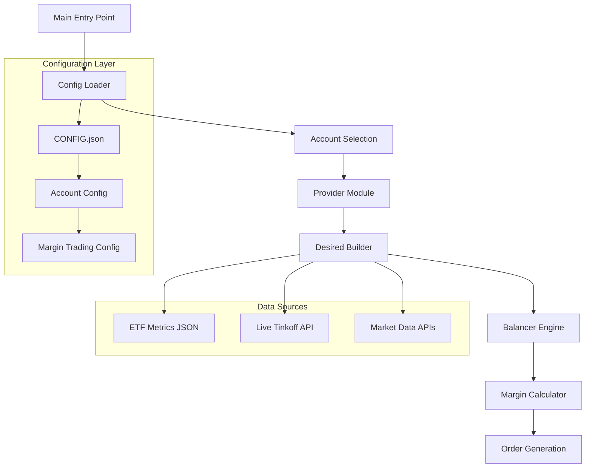
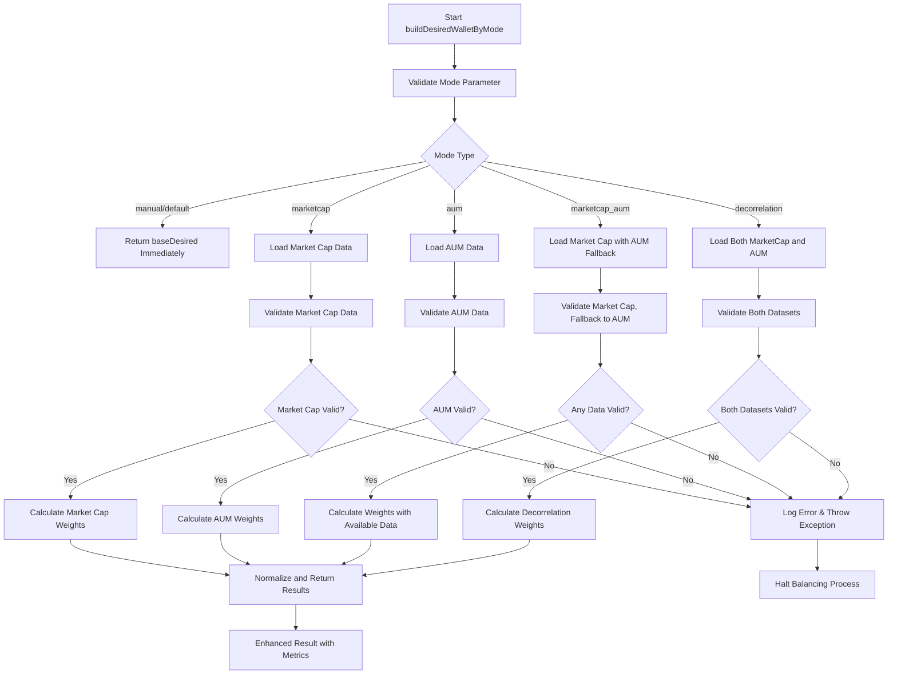
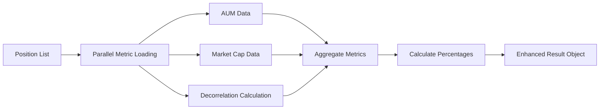
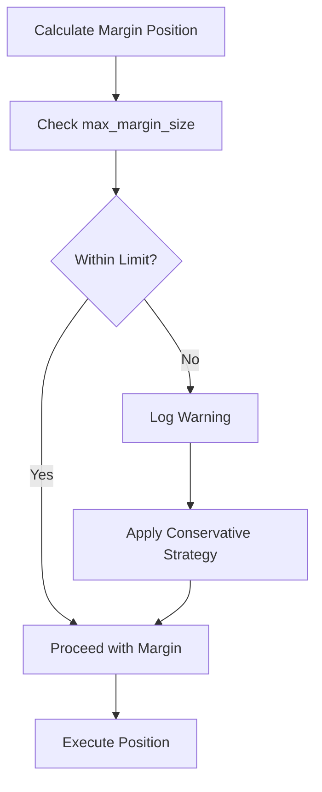

# ETF Balancer Bot Enhancements Design

## Overview

This design addresses three critical issues identified in the tinkoff-invest-etf-balancer-bot project:
1. **Broken balancing mode selection** - Different configurations in CONFIG.json are not working properly
2. **Enhanced result information** - Adding AUM values/percentages, market cap values/percentages, and decorrelation values/percentages to results
3. **Maximum margin size configuration** - Adding configurable maximum margin size with default value of 5000 RUB

## Technology Stack

- **Backend Framework**: Node.js with TypeScript and Bun.js runtime
- **Configuration**: JSON-based configuration with environment variables
- **API Integration**: Tinkoff Invest SDK for portfolio management
- **Data Sources**: ETF metrics from local JSON files and live APIs

## Architecture

### Current System Architecture



### Issue Analysis

#### 1. Balancing Mode Selection Issue

**Root Cause**: The `desired_mode` configuration is properly defined in types but not fully implemented in the mode selection logic.

**Current Implementation Gap**:
- `buildDesiredWalletByMode` function exists but may not handle all modes correctly
- Missing proper mode validation and fallback handling
- Potential issues with mode-specific metric gathering

#### 2. Result Information Enhancement

**Current Limitation**: The balancer result only returns `finalPercents` without detailed metric information.

**Missing Information**:
- AUM values and percentages for each position
- Market capitalization values and percentages  
- Decorrelation values and percentages
- Detailed breakdown of how each mode calculated the weights

#### 3. Margin Trading Configuration

**Current Implementation**: Fixed free threshold of 5000 RUB hardcoded in margin calculator.

**Enhancement Needed**: Make maximum margin size configurable per account.

## Data Models & Configuration Enhancement

### Enhanced Account Configuration

```typescript
export interface AccountMarginConfig {
  enabled: boolean;
  multiplier: number;
  free_threshold: number;
  max_margin_size: number; // NEW: Maximum margin size in RUB
  balancing_strategy: MarginBalancingStrategy;
}

export interface AccountConfig {
  id: string;
  name: string;
  t_invest_token: string;
  account_id: string;
  desired_wallet: DesiredWallet;
  desired_mode: DesiredMode;
  balance_interval: number;
  sleep_between_orders: number;
  margin_trading: AccountMarginConfig; // Enhanced
}
```

### Enhanced Result Data Model

```typescript
export interface PositionMetrics {
  ticker: string;
  aum?: {
    value: number; // AUM value in RUB
    percentage: number; // Percentage of total AUM
  };
  marketCap?: {
    value: number; // Market cap value in RUB  
    percentage: number; // Percentage of total market cap
  };
  decorrelation?: {
    value: number; // Decorrelation percentage
    interpretation: 'undervalued' | 'overvalued' | 'neutral';
  };
}

export interface EnhancedBalancerResult {
  finalPercents: Record<string, number>;
  modeUsed: DesiredMode;
  positionMetrics: PositionMetrics[];
  totalPortfolioValue: number;
  marginInfo?: {
    totalMarginUsed: number;
    marginPositions: MarginPosition[];
    withinLimits: boolean;
  };
}
```

## Business Logic Layer

### 1. Enhanced Balancing Mode Selection

#### Current Issue Analysis

The balancing mode selection in `buildDesiredWalletByMode` has several issues:
- Missing comprehensive error handling for failed metric loading
- No proper validation of data quality before weight calculation  
- Insufficient fallback mechanisms when mode-specific data is unavailable
- Limited debugging information for troubleshooting mode failures

#### Enhanced Mode Validation and Fallback Logic



#### Enhanced Mode Implementation Strategy

**Data Validation Framework**:
- **Completeness Check**: Verify all required tickers have data
- **Quality Validation**: Ensure numeric values are finite and positive
- **Freshness Validation**: Check data timestamps for staleness
- **Consistency Check**: Verify data consistency across sources

**Strict Validation Strategy**:
1. **Primary Mode**: Use specified mode if all data is available and valid
2. **Partial Fallback**: For `marketcap_aum` mode, fallback to AUM if market cap unavailable
3. **Strict Failure**: Throw exception and halt balancing if required data is unavailable
4. **Error Reporting**: Log detailed failure reasons for debugging and user notification

**Enhanced Error Handling**:
- **Structured Logging**: Use debug categories for different failure types
- **User Notifications**: Provide clear error messages when balancing cannot proceed
- **Recovery Suggestions**: Offer specific guidance for fixing data issues
- **Exception Management**: Proper exception handling to prevent system crashes

#### Error Handling and Balancing Termination

**When to Halt Balancing**:
- **Invalid Market Cap Data**: For `marketcap` mode, if market cap data is unavailable or invalid
- **Invalid AUM Data**: For `aum` mode, if AUM data is unavailable or invalid
- **No Valid Data**: For `marketcap_aum` mode, if neither market cap nor AUM data is available
- **Incomplete Decorrelation Data**: For `decorrelation` mode, if either market cap or AUM data is missing

**Exception Handling Strategy**:
```typescript
class BalancingDataError extends Error {
  constructor(
    public mode: DesiredMode,
    public missingData: string[],
    public affectedTickers: string[]
  ) {
    super(`Balancing halted: ${mode} mode requires ${missingData.join(', ')} data for tickers: ${affectedTickers.join(', ')}`);
  }
}
```

**Provider Integration**:
- The provider should catch `BalancingDataError` exceptions
- Log detailed error information for debugging
- Skip current balancing cycle and wait for next interval
- Notify user about data requirements

### 2. Enhanced Result Information

#### Metric Collection Strategy



#### Result Enhancement Implementation

**AUM Information**:
- Load AUM data for each position
- Calculate total portfolio AUM
- Compute percentage distribution of AUM across positions

**Market Cap Information**:
- Load market capitalization for each position
- Calculate total portfolio market cap  
- Compute percentage distribution of market cap across positions

**Decorrelation Information**:
- Calculate decorrelation percentage: `(marketCap - AUM) / AUM * 100`
- Classify as undervalued (negative), overvalued (positive), or neutral (near zero)
- Provide interpretation for decision making

### 3. Margin Trading Enhancement

#### Configuration Enhancement

**Default Configuration Update**:
```json
{
  "margin_trading": {
    "enabled": false,
    "multiplier": 4,
    "free_threshold": 5000,
    "max_margin_size": 5000,
    "balancing_strategy": "keep_if_small"
  }
}
```

#### Margin Size Validation



## API Endpoints Reference

### Enhanced Balancer Response

#### Current Response Format
```typescript
// Current
{ finalPercents: Record<string, number> }
```

#### Enhanced Response Format  
```typescript
// Enhanced
{
  finalPercents: Record<string, number>;
  modeUsed: DesiredMode;
  positionMetrics: PositionMetrics[];
  totalPortfolioValue: number;
  marginInfo?: MarginInfo;
}
```

### Detailed Output Enhancement

#### Current Format
```
TPAY: +1.00%: 18.00% -> 19.00% (19.00%)
```

#### Enhanced Format
```
TPAY: +1.00%: 18.00% -> 19.00% (19.00%)
  AUM: 2.5B RUB (15.2% of portfolio AUM)
  Market Cap: 2.8B RUB (16.1% of portfolio cap) 
  Decorrelation: +12.0% (overvalued)
```

## Component Architecture

### 1. Enhanced Desired Builder Component

**Location**: `src/balancer/desiredBuilder.ts`

**Enhancements**:
- Robust error handling for each mode
- Data validation before weight calculation
- Metric caching for performance
- Detailed logging for debugging

**Key Functions**:
```typescript
async function buildDesiredWalletByModeEnhanced(
  mode: DesiredMode, 
  baseDesired: DesiredWallet
): Promise<{
  wallet: DesiredWallet;
  metrics: PositionMetrics[];
  modeApplied: DesiredMode;
}>
```

### 2. Enhanced Balancer Engine

**Location**: `src/balancer/index.ts`

**Enhancements**:
- Return enhanced result object
- Include position metrics in response
- Validate margin limits using new configuration
- Improved logging and debugging

**Key Functions**:
```typescript
async function balancer(
  positions: Wallet, 
  desiredWallet: DesiredWallet
): Promise<EnhancedBalancerResult>
```

### 3. Enhanced Margin Calculator

**Location**: `src/utils/marginCalculator.ts`

**Enhancements**:
- Use configurable `max_margin_size` from account config
- Validate margin positions against limits
- Enhanced margin reporting

**Configuration Integration**:
```typescript
class MarginCalculator {
  constructor(
    private config: MarginConfig & { maxMarginSize: number }
  ) {}
  
  validateMarginLimits(positions: MarginPosition[]): boolean {
    const totalMargin = positions.reduce(
      (sum, pos) => sum + (pos.marginValue || 0), 0
    );
    return totalMargin <= this.config.maxMarginSize;
  }
}
```

## Configuration Files Enhancement

### CONFIG.json Schema Update

```json
{
  "accounts": [
    {
      "id": "account_1",
      "name": "Main Account",
      "t_invest_token": "${T_INVEST_TOKEN_1}",
      "account_id": "BROKER", 
      "desired_wallet": {
        "TPAY": 25,
        "TGLD": 25,
        "TRUR": 25,
        "TRND": 25
      },
      "desired_mode": "decorrelation",
      "balance_interval": 3600000,
      "sleep_between_orders": 3000,
      "margin_trading": {
        "enabled": true,
        "multiplier": 4,
        "free_threshold": 5000,
        "max_margin_size": 5000,
        "balancing_strategy": "keep_if_small"
      }
    }
  ]
}
```

### Configuration Validation Enhancement

**Enhanced Validation Rules**:
- Validate `desired_mode` is a valid enum value
- Ensure `max_margin_size >= free_threshold` 
- Validate `max_margin_size > 0` when margin trading enabled
- Check mode-specific requirements (e.g., ETF metrics availability for decorrelation mode)

## Testing Strategy

### Unit Testing Enhancement

**New Test Cases**:

1. **Mode Selection Tests**:
   - Test each `desired_mode` with valid data
   - Test exception throwing with invalid/missing data
   - Test mode validation and error handling
   - Test provider's exception handling for halted balancing

2. **Enhanced Result Tests**:
   - Verify position metrics are correctly calculated
   - Test AUM and market cap percentage calculations
   - Validate decorrelation interpretation logic

3. **Margin Configuration Tests**:
   - Test margin size validation with new limits
   - Verify configuration loading and validation
   - Test margin calculator with enhanced config

### Integration Testing

**Scenarios**:
- End-to-end balancing with different modes
- Configuration loading with enhanced margin settings
- Result output with enhanced information display

## Implementation Phases

### Phase 1: Fix Balancing Mode Selection
1. Enhanced `buildDesiredWalletByMode` with strict error handling
2. Exception-based mode validation (no fallback to baseDesired)
3. Provider-level exception handling for halted balancing
4. Comprehensive logging for debugging
5. Unit tests for all modes including exception scenarios

### Phase 2: Enhanced Result Information  
1. Extend result data model with position metrics
2. Implement AUM, market cap, and decorrelation calculation
3. Update result output format
4. Enhanced detailed balancing output

### Phase 3: Margin Trading Enhancement
1. Add `max_margin_size` to configuration schema
2. Update margin calculator with new limits
3. Enhanced margin validation and reporting
4. Configuration migration support

### Phase 4: Testing and Validation
1. Comprehensive unit and integration tests
2. Configuration validation testing
3. Performance testing with enhanced features
4. Documentation updates

## Configuration Migration

### Automatic Migration Support

**Migration Strategy**:
- Detect old configuration format
- Add default `max_margin_size` if missing
- Validate enhanced configuration
- Provide migration warnings/guidance

**Example Migration Logic**:
```typescript
function migrateAccountConfig(config: any): AccountConfig {
  if (!config.margin_trading.max_margin_size) {
    config.margin_trading.max_margin_size = 5000; // Default value
    console.warn('Added default max_margin_size: 5000 RUB');
  }
  return config;
}
```

## Error Handling & Logging

### Enhanced Error Handling

**Mode Selection Errors**:
- Throw exceptions when required data is unavailable
- Detailed error logging with context
- User-friendly error messages with recovery guidance
- Proper exception propagation to provider layer

**Balancing Cycle Management**:
- Provider catches balancing exceptions
- Logs error details for debugging
- Skips current balancing cycle
- Continues with next scheduled cycle
- Notifies user about data requirements

**Configuration Errors**:
- Clear validation messages
- Specific guidance for fixing issues
- Migration assistance

**Margin Limit Errors**:
- Clear warnings when limits exceeded
- Automatic application of conservative strategies
- Detailed margin usage reporting

### Logging Enhancement

**New Debug Categories**:
- `balancer:mode-selection` - Mode selection debugging
- `balancer:metrics` - Metric collection and calculation
- `balancer:margin-limits` - Margin validation and limits

## Performance Considerations

### Metric Loading Optimization

**Parallel Processing**:
- Load AUM, market cap, and decorrelation data in parallel
- Cache frequently accessed metrics
- Implement timeout handling for live API calls

**Memory Management**:
- Avoid loading unnecessary historical data
- Implement metric data cleanup after processing
- Use streaming for large datasets when applicable

### Configuration Caching

**Strategy**:
- Cache parsed configuration to avoid repeated JSON parsing
- Implement configuration change detection
- Reload only when necessary

This design addresses all three identified issues while maintaining backward compatibility and providing a solid foundation for future enhancements.


