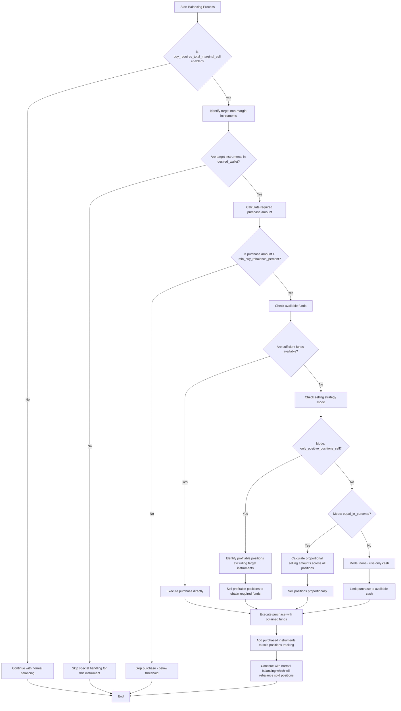

# Configuration Update: Buy Requires Total Marginal Sell Feature

## Overview

This document specifies the addition of a new configuration block to handle the purchase of non-margin instruments with specific selling strategies. This feature allows users to define how other positions should be sold to fund purchases of non-margin instruments.

## New Configuration Fields

The following new configuration fields will be added to the account configuration:

```json
{
  "buy_requires_total_marginal_sell": {
    "enabled": false,
    "instruments": ["TMON"],
    "allow_to_sell_others_positions_to_buy_non_marginal_positions": {
      "mode": "only_positive_positions_sell"
    },
    "min_buy_rebalance_percent": 0.10
  }
}
```

### Complete Configuration Example

Here's a complete example showing how the new configuration block integrates with an existing account configuration:

```json
{
  "accounts": [
    {
      "id": "account_1",
      "name": "Основной брокерский счет",
      "t_invest_token": "${T_INVEST_TOKEN}",
      "account_id": "BROKER",
      "desired_wallet": {
        "TRAY": 8.33,
        "TGLD": 8.33,
        "TRUR": 8.33,
        "TRND": 8.33,
        "TBRU": 8.33,
        "TDIV": 8.33,
        "TITR": 8.33,
        "TLCB": 8.33,
        "TMON": 8.33,
        "TMOS": 8.33,
        "TOFZ": 8.33,
        "TPAY": 8.33
      },
      "desired_mode": "manual",
      "balance_interval": 3600000,
      "sleep_between_orders": 3000,
      "exchange_closure_behavior": {
        "mode": "dry_run",
        "update_iteration_result": true
      },
      "margin_trading": {
        "enabled": false,
        "multiplier": 4,
        "free_threshold": 5000,
        "max_margin_size": 5000,
        "balancing_strategy": "keep_if_small"
      },
      "buy_requires_total_marginal_sell": {
        "enabled": true,
        "instruments": ["TMON", "TGLD"],
        "allow_to_sell_others_positions_to_buy_non_marginal_positions": {
          "mode": "only_positive_positions_sell"
        },
        "min_buy_rebalance_percent": 0.5
      }
    }
  ]
}
```

### Field Descriptions

1. `buy_requires_total_marginal_sell` (object) - Configuration block for special handling of non-margin instrument purchases
   - `enabled` (boolean) - Enables/disables all features of this block
   - `instruments` (array of strings) - List of non-margin instruments requiring special purchase order
   - `allow_to_sell_others_positions_to_buy_non_marginal_positions` (object) - Strategy for selling other positions to fund purchases
     - `mode` (string) - Selling strategy mode:
       - `only_positive_positions_sell` - Sell only profitable positions (excluding instruments in the instruments list) to obtain RUB
       - `equal_in_percents` - Sell proportionally to current positions
       - `none` - Do not sell other assets, use only cash
   - `min_buy_rebalance_percent` (number) - Minimum rebalancing threshold for purchases under these rules

## Algorithm Specification

The following Mermaid diagram illustrates the algorithm flow for handling purchases of non-margin instruments:



### Identifying Profitable Positions

When using the `only_positive_positions_sell` mode, the algorithm identifies profitable positions by:

1. Calculating the current value of each position
2. Comparing with the original purchase cost of each position
3. Selecting only positions where current value > purchase cost (positive profit)
4. Excluding any instruments listed in `buy_requires_total_marginal_sell.instruments` from consideration
5. Sorting profitable positions by profit amount or percentage

The profit calculation for each position:
- Profit Amount = Current Position Value - Original Purchase Cost
- Profit Percentage = (Profit Amount / Original Purchase Cost) × 100%

Positions with positive profit values are considered for selling, while those with negative or zero profit are excluded.

### Rebalancing After Special Purchases

After executing special purchases of non-margin instruments:

1. The purchased instruments are added to a tracking list of "sold positions"
2. Normal balancing continues, which will automatically rebalance all positions including those that were sold
3. The previously sold positions will be repurchased to maintain the desired portfolio allocation
4. This ensures that temporary sales for special purchases don't permanently alter the portfolio composition

## Implementation Details

### Type Definitions

The following TypeScript interfaces will be added to support the new configuration:

```typescript
export type SellStrategyMode = 'only_positive_positions_sell' | 'equal_in_percents' | 'none';

export interface SellStrategyConfig {
  mode: SellStrategyMode;
}

export interface BuyRequiresTotalMarginalSellConfig {
  enabled: boolean;
  instruments: string[];
  allow_to_sell_others_positions_to_buy_non_marginal_positions: SellStrategyConfig;
  min_buy_rebalance_percent: number;
}

// Updated AccountConfig interface
export interface AccountConfig {
  // ... existing fields ...
  buy_requires_total_marginal_sell?: BuyRequiresTotalMarginalSellConfig;
}
```

### Configuration Validation

The configuration validation will include the following checks:

1. If `buy_requires_total_marginal_sell` is present:
   - `enabled` must be a boolean
   - `instruments` must be an array of strings (ticker symbols)
   - `allow_to_sell_others_positions_to_buy_non_marginal_positions.mode` must be one of the valid modes
   - `min_buy_rebalance_percent` must be a number between 0 and 100

2. Cross-field validation:
   - Instruments listed in `instruments` must also exist in the account's `desired_wallet`
   - When `mode` is `none`, other positions should not be sold even if funds are insufficient

3. Default values when the block is not present:
   - `enabled`: false
   - `instruments`: []
   - `allow_to_sell_others_positions_to_buy_non_marginal_positions.mode`: 'none'
   - `min_buy_rebalance_percent`: 0.1

## Integration with Existing Components

### ConfigLoader Integration

The `ConfigLoader` class in `src/configLoader.ts` will be updated to:
1. Include validation for the new configuration fields
2. Provide default values when the configuration block is missing
3. Add new getter methods for accessing the configuration

### Balancer Integration

The balancer logic in `src/balancer/` will be updated to:
1. Check for the presence of the new configuration
2. Apply the special selling strategy when purchasing non-margin instruments
3. Respect the minimum rebalancing threshold

### Testing

New test cases will be added to:
1. Validate the new configuration structure
2. Test each selling strategy mode
3. Verify the threshold behavior
4. Ensure backward compatibility when the configuration block is absent