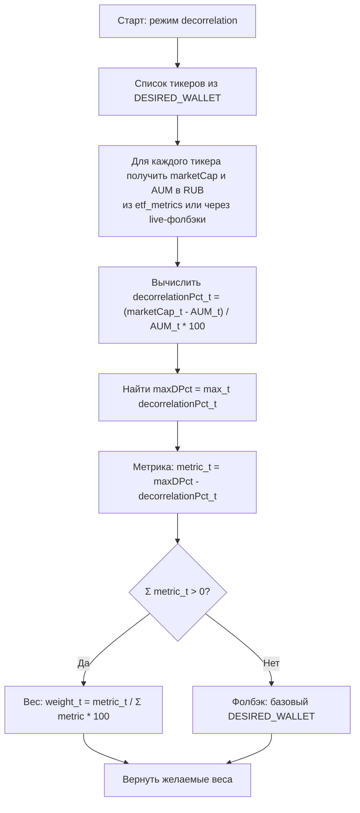

# Trading Bot Balancer
This bot participates in the [Tinkoff Invest Robot Contest](https://github.com/Tinkoff/invest-robot-contest).

Appname: suenot

### Disclaimer
The platform operates in test mode (a test version), and there may be software/algorithmic errors. The models do not guarantee profitability and may trade at a loss. The user assumes full responsibility for the application of this product.

### Requirements
**IMPORTANT**: It only works with Russian ruble stocks and funds. There should be no other instruments in the account for proper operation.

A simple portfolio balancer.
- Retrieves the real portfolio in the account.
- Adjusts it to the desired portfolio.
    Example of a desired portfolio:
    ```js
    export const DESIRED_WALLET: DesiredWallet = {
      TRAY: 25, // 25% Tinkoff Passive
      TGLD: 25, // 25% Tinkoff Gold
      TRUR: 25, // 25% Tinkoff Eternal Portfolio
    };
    ```
- Places the necessary orders for buying and selling to balance the portfolio. Currently, these are market orders.
- The cycle repeats.
### Example of Balancing


1000 rubles were balanced as follows:
  - 20% Tinkoff iMOEX (TMOS)
  - 20% Russian Ruble
  - 20% Tinkoff Eternal Portfolio (TRUR)
  - 20% VTB shares
### Settings
To use the bot, you need to [obtain a token](https://www.tinkoff.ru/invest/settings).

ACCOUNT_ID can be:
- exact id returned by the API,
- BROKER (to pick brokerage account),
- ISS (to pick IIA),
- INDEX:N (to pick account by index in the list from `npm run accounts`),
- N (just a number string like `0`, shorthand for INDEX:N).

You need an account with only Russian ruble assets and create an .env file with the following settings:
```bash
TOKEN=
ACCOUNT_ID=
```

Desired portfolio settings in percentages and the interval between rebalancing can be adjusted in ./src/config.js:
```js
export const desiredWallet: DesiredWallet = {
  TMOS: 25, // 25% Tinkoff iMOEX (TMOS)
  RUB: 25, // 25% Russian Ruble
  TRUR: 50, // 50% Tinkoff Eternal Portfolio (TRUR)
};

export const balancerInterval: number = 60000; // Once per minute
```

### Running
```
npm i
npm run start
```

Run with debug logs and one-time balance without cycle:
```
npm run dev -- --once
```

### Additional Information
Originally, a bot with an [associative data structure](https://github.com/suenot/deep-tinkoff-invest) was prepared for the contest, but due to time constraints, I decided to take an easier task.

_________________

# Торговый бот балансировщик (Russian readme)
Этот бот участвует в конкурсе [Tinkoff Invest Robot Contest](https://github.com/Tinkoff/invest-robot-contest).

Appname: suenot

### Отказ от ответственности
Платформа работает в тестовом режиме (тестовая версия), возможны программные/алгоритмические ошибки, модели не гарантируют доходность и могу торговать в убыток. Пользователь полностью принимает ответственность за применение данного продукта на себя.

### Требования
**ВАЖНО**: Работает только с рублевыми акциями и фондами. Других инструментов для корректной работы находиться на счету не должно.

Простой балансировщик портфелей.
- Получает реальный портфель на счете.
- Приводит его к желаемому портфелю.
    Пример желаемого портфеля:
    ```js
    export const DESIRED_WALLET: DesiredWallet = {
      TMOS: 25, // 25% Тинькофф iMOEX (TMOS)
      RUB: 25, // 25% Рублей
      TBRU: 25, // 25% Тинькофф Bonds
      TRUR: 25, // 25% Тинькофф Вечный портфель (TRUR)
    };
    ```
- Выставляет необходимые для балансировки ордера на покупку и продажу. Пока это рыночные ордера.
- Цикл повторяется
### Пример балансировки


1000 рублей были сбалансированы на:
  - 20% Тинькофф iMOEX (TMOS)
  - 20% Рублей
  - 20% Тинькофф Вечный 
  - 20% Акции ВТБ
### Настройки
Для работы бота вам необходимо [получить токен](https://www.tinkoff.ru/invest/settings).

ACCOUNT_ID может быть:
- точным id из API,
- BROKER — выбрать брокерский счет,
- ISS — выбрать ИИС,
- INDEX:N — выбрать счет по индексу из списка (`npm run accounts`),
- N — просто число строкой, например `0` (короткая форма INDEX:N).

Требуется счет только с рублевыми активами и создать .env файл с настройками
```bash
TOKEN=
ACCOUNT_ID=
```

## Балансировка по decorrelation

Алгоритм формирования целевых весов в режиме `decorrelation`.



Пример нормализации:

```text
Вход: dPct = { coin1: 100, coin2: 0, coin3: -100 }
maxDPct = 100
metric = { coin1: 0, coin2: 100, coin3: 200 }
Σmetric = 300 → веса ≈ { coin1: 0%, coin2: 33%, coin3: 66% }
```

Желаемые настройки портфеля в процентах и перерыв между балансировками настраиваются в `./src/config.js`:
```js
export const desiredWallet: DesiredWallet = {
  TMOS: 25, // 25% Тинькофф iMOEX (TMOS)
  RUB: 25, // 25% Рублей
  TRUR: 50, // 50% Тинькофф Вечный портфель (TRUR)
};

export const balancerInterval: number = 60000; // Раз в минуту
```
### Запуск
```
npm i
npm run start
```

Одноразовый запуск без цикла (например, для ручной ребалансировки один раз):
```
npm run dev -- --once
```

### Список счетов
Чтобы посмотреть свои счета и их id (для удобного выбора `ACCOUNT_ID`):
```
npm run accounts
```

### Дополнительно

Изначально к конкурсу готовился [бот с ассоциативной структурой данных](https://github.com/suenot/deep-tinkoff-invest), но из-за нехватки времени решил взять задачу попроще.

## Схема работы (Mermaid)
```mermaid
flowchart TD
  A[Start npm run start/dev] --> B[Load .env TOKEN, ACCOUNT_ID]
  B --> C[createSdk(TINKOFF)]
  C --> D[provider()]
  D --> E[getAccountId(ACCOUNT_ID)]
  E -->|id/BROKER/ISS/INDEX:N| F[ACCOUNT_ID determined]
  F --> G[getInstruments()]
  G -->|fill global INSTRUMENTS: shares, etfs, bonds, currencies, futures| H[getPositionsCycle()]

  subgraph Cycle[Every BALANCE_INTERVAL ms]
    H --> I[operations.getPortfolio(accountId)]
    I --> J[operations.getPositions(accountId)]
    J --> K[Build coreWallet]
    K -->|Add currencies from positions.money (RUB)| L
    K -->|Add portfolio positions with last prices| L[coreWallet ready]
    L --> M[balancer(coreWallet, DESIRED_WALLET)]

    subgraph Balancer
      M --> N[normalizeDesire to 100%]
      N --> O[Ensure desired tickers exist in wallet]
      O --> P[getLastPrice(figi) for missing tickers]
      P --> Q[Compute totals, desiredAmountNumber]
      Q --> R[Compute toBuyLots per position]
      R --> S[Sort orders (sells first)]
      S --> T[generateOrders()]
    end

    T --> U{position.base !== 'RUB' && |toBuyLots| >= 1?}
    U -- Yes --> V[orders.postOrder MARKET]
    V --> W[sleep SLEEP_BETWEEN_ORDERS]
    U -- No --> X[Skip]
    W --> Y[Next position]
    X --> Y
    Y --> Z[Cycle next tick]
  end
```

### Парсер новостей Т‑Банк ETF (TRUR)

- Скрипт забирает новости со страницы `https://www.tbank.ru/invest/etfs/TRUR/news/`, нажимает «Показать ещё» до упора (или до заданного лимита), открывает каждую новость и сохраняет материал в `news/<SYMBOL>/<id>.md`.

Запуск по умолчанию (TRUR):

```
npm run scrape:tbank:news
```

Произвольный запуск:

```
npx ts-node --transpile-only ./src/tools/scrapeTbankNews.ts <SYMBOL> [--limit=N] [--first-limit=N] [--once] [--interval=MS]
```

Где:
- `--limit=N` — общий лимит новостей для текущего запуска. Скрипт подгружает ленту до ориентировочного количества ссылок `N` и сохранит не более `N` новых материалов.
- `--first-limit=N` — лимит только для первого запуска (когда папка `news/<SYMBOL>/` пуста). На последующих запусках игнорируется, используйте `--limit`.
- `--once` — одноразовый запуск (без цикличности).
- `--interval=MS` — периодичность цикличного запуска в миллисекундах (по умолчанию 300000 = 5 минут), игнорируется при `--once`.
- Позиционный числовой аргумент (`<N>`) трактуется как `--limit=N`.

Примеры:

```
# 10 новостей TRUR
npx ts-node --transpile-only ./src/tools/scrapeTbankNews.ts TRUR --limit=10 --once

# Первый запуск: забрать только ~300 новостей
npx ts-node --transpile-only ./src/tools/scrapeTbankNews.ts TRUR --first-limit=300 --once

# Циклично каждые 10 минут
npx ts-node --transpile-only ./src/tools/scrapeTbankNews.ts TRUR --limit=50 --interval=600000
```
