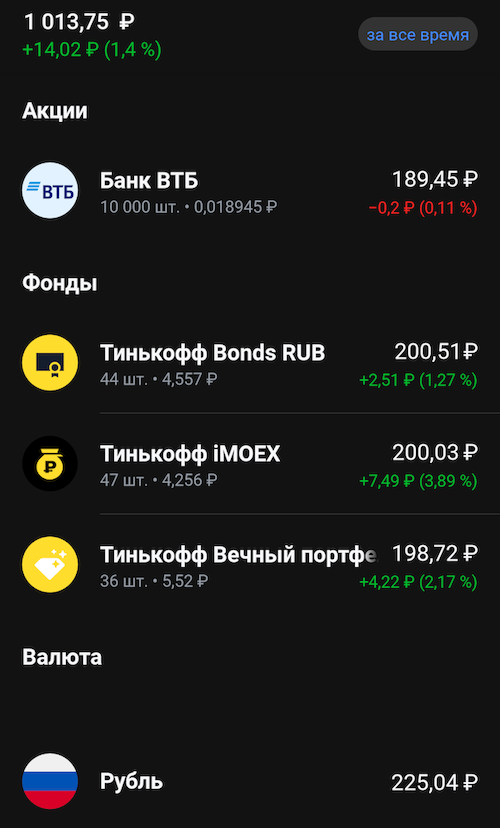
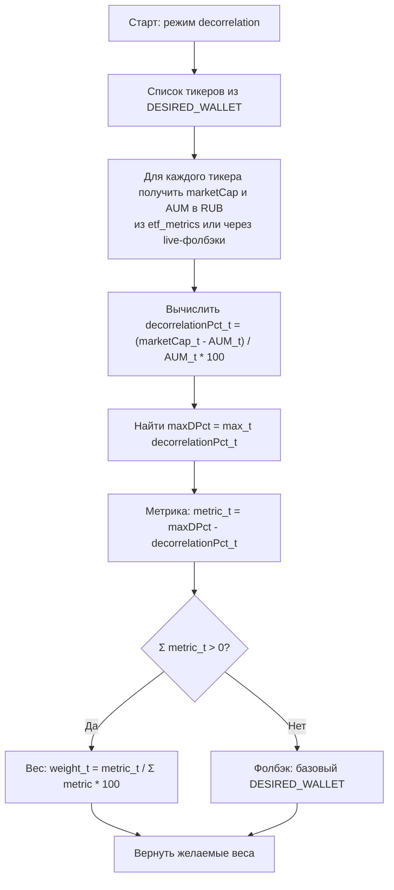
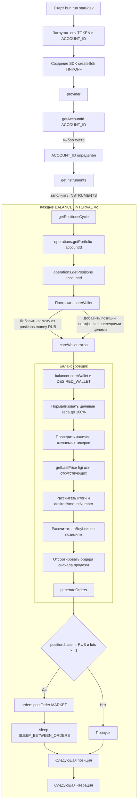

# Торговый бот балансировщик
Этот бот участвует в конкурсе [Tinkoff Invest Robot Contest](https://github.com/Tinkoff/invest-robot-contest).

Имя приложения: suenot

## 🆕 Что нового?

**Система конфигурации множественных аккаунтов!** Теперь вы можете балансировать несколько счетов Tinkoff Invest одновременно с разными настройками для каждого.

- 📊 **Множественные аккаунты** - неограниченное количество счетов
- 🔧 **Гибкая конфигурация** - разные настройки для разных аккаунтов  
- 🛡️ **Безопасность** - токены хранятся в переменных окружения
- ✅ **Валидация** - автоматическая проверка корректности настроек
- 🎯 **Удобное управление** - CLI-команды для работы с конфигурацией

Подробности: [README.config.md](./README.config.md)

## 🚀 Bun.js Edition

**Проект успешно мигрирован на Bun.js!** Для максимальной производительности используйте Bun.js вместо Node.js.

### Быстрый старт с Bun.js

```bash
# Установка Bun.js
curl -fsSL https://bun.sh/install | bash
export PATH="$HOME/.bun/bin:$PATH"

# Установка зависимостей
bun install

# Запуск
bun run start
```

**Преимущества Bun.js:**
- ⚡ Встроенная поддержка TypeScript (без ts-node)
- 🚀 Сборка в 20-30 раз быстрее
- 📦 Меньше зависимостей
- 🔄 Современные ES модули

Подробнее: [README.bunjs.md](./README.bunjs.md)

---

### Отказ от ответственности
Платформа работает в тестовом режиме (тестовая версия), возможны программные/алгоритмические ошибки, модели не гарантируют доходность и могу торговать в убыток. Пользователь полностью принимает ответственность за применение данного продукта на себя.

### Требования
**ВАЖНО**: Работает только с рублевыми акциями и фондами. Других инструментов для корректной работы находиться на счету не должно.

Простой балансировщик портфелей.
- Получает реальный портфель на счете.
- Приводит его к желаемому портфелю.
    Пример желаемого портфеля:
    ```js
    export const DESIRED_WALLET: DesiredWallet = {
      TMOS: 25, // 25% Тинькофф iMOEX (TMOS)
      RUB: 25, // 25% Рублей
      TBRU: 25, // 25% Тинькофф Bonds
      TRUR: 25, // 25% Тинькофф Вечный портфель (TRUR)
    };
    ```
- Выставляет необходимые для балансировки ордера на покупку и продажу. Пока это рыночные ордера.
- Цикл повторяется
### Пример балансировки


1000 рублей были сбалансированы на:
  - 20% Тинькофф iMOEX (TMOS)
  - 20% Рублей
  - 20% Тинькофф Вечный 
  - 20% Акции ВТБ
### Настройки
Для работы бота вам необходимо [получить токен](https://www.tinkoff.ru/invest/settings).

**🆕 Новая система конфигурации множественных аккаунтов!**

Теперь конфигурация хранится в `CONFIG.json` и поддерживает множество аккаунтов. Подробности: [README.config.md](./README.config.md)

#### Быстрый старт:
1. Скопируйте `.env-example` в `.env`
2. Укажите токены для ваших аккаунтов
3. Настройте `CONFIG.json` под ваши нужды

#### Управление конфигурацией:
```bash
# Просмотр всех аккаунтов
bun run config list

# Детали конкретного аккаунта
bun run config show account_1

# Валидация конфигурации
bun run config validate

# Настройка переменных окружения
bun run config env
```

#### Пример .env файла:
```bash
T_INVEST_TOKEN_1=your_first_token_here
T_INVEST_TOKEN_2=your_second_token_here
OPENROUTER_API_KEY=your_api_key_here
```

## Балансировка по decorrelation

Алгоритм формирования целевых весов в режиме `decorrelation`.



Пример нормализации:

```text
Вход: dPct = { coin1: 100, coin2: 0, coin3: -100 }
maxDPct = 100
metric = { coin1: 0, coin2: 100, coin3: 200 }
Σmetric = 300 → веса ≈ { coin1: 0%, coin2: 33%, coin3: 66% }
```

Желаемые настройки портфеля в процентах и перерыв между балансировками настраиваются в `./src/config.js`:
```js
export const desiredWallet: DesiredWallet = {
  TMOS: 25, // 25% Тинькофф iMOEX (TMOS)
  RUB: 25, // 25% Рублей
  TRUR: 50, // 50% Тинькофф Вечный портфель (TRUR)
};

export const balancerInterval: number = 60000; // Раз в минуту
```
### Запуск

#### С Bun.js (рекомендуется)
```bash
# Установка зависимостей
bun install

# Запуск
bun run start
```


Одноразовый запуск без цикла (например, для ручной ребалансировки один раз):

**Bun.js:**
```bash
bun run dev -- --once
```


### Список счетов
Чтобы посмотреть свои счета и их id (для удобного выбора `ACCOUNT_ID`):

**Bun.js:**
```bash
bun run accounts
```


### Дополнительно

Изначально к конкурсу готовился [бот с ассоциативной структурой данных](https://github.com/suenot/deep-tinkoff-invest), но из-за нехватки времени решил взять задачу попроще.

## Схема работы (Mermaid)


### Парсер новостей Т‑Банк ETF (TRUR)

- Скрипт забирает новости со страницы `https://www.tbank.ru/invest/etfs/TRUR/news/`, нажимает «Показать ещё» до упора (или до заданного лимита), открывает каждую новость и сохраняет материал в `news/<SYMBOL>/<id>.md`.

Запуск по умолчанию (TRUR):

```
bun run scrape:tbank:news
```

Произвольный запуск:

```
npx ts-node --transpile-only ./src/tools/scrapeTbankNews.ts <SYMBOL> [--limit=N] [--first-limit=N] [--once] [--interval=MS]
```

Где:
- `--limit=N` — общий лимит новостей для текущего запуска. Скрипт подгружает ленту до ориентировочного количества ссылок `N` и сохранит не более `N` новых материалов.
- `--first-limit=N` — лимит только для первого запуска (когда папка `news/<SYMBOL>/` пуста). На последующих запусках игнорируется, используйте `--limit`.
- `--once` — одноразовый запуск (без цикличности).
- `--interval=MS` — периодичность цикличного запуска в миллисекундах (по умолчанию 300000 = 5 минут), игнорируется при `--once`.
- Позиционный числовой аргумент (`<N>`) трактуется как `--limit=N`.

Примеры:

```
# 10 новостей TRUR
npx ts-node --transpile-only ./src/tools/scrapeTbankNews.ts TRUR --limit=10 --once

# Первый запуск: забрать только ~300 новостей
npx ts-node --transpile-only ./src/tools/scrapeTbankNews.ts TRUR --first-limit=300 --once

# Циклично каждые 10 минут
npx ts-node --transpile-only ./src/tools/scrapeTbankNews.ts TRUR --limit=50 --interval=600000
```


# Источники данных
- СЧА (AUM) - https://t-capital-funds.ru/statistics/
- Количество паев, капитализация - https://www.tbank.ru/invest/etfs/TDIV@/news/
- Полное название фонда + тикер - https://investfunds.ru/funds/7067/